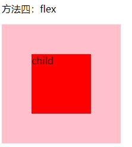

## 方法一:绝对定位方法 1

- 绝对定位方法：不确定当前 div 的宽度和高度，采用 transform: translate(-50%,-50%)

- 不兼容 ie8 及以下

- 代码

  ```css
  .box1 {
    position: relative;
  }

  .child1 {
    width: 80%;
    height: 60%;
    position: absolute;
    left: 50%;
    top: 50%;
    transform: translate(-50%, -50%);
  }
  ```

- 效果展示：

  

## 方法二:绝对定位方法 2

- 绝对定位方法：确定了当前 div 的宽度，margin 值为当前 div 宽度一半的负值
- 兼容性好，支持 ie8
- 代码如下：

```css
.box2 {
  position: relative;
}

.child2 {
  width: 100px;
  height: 100px;
  position: absolute;
  left: 50%;
  top: 50%;
  margin: -50px -50px;
}
```

- 效果展示：


## 方法三:绝对定位方法 3

- 绝对定位方法：已知宽高绝对定位下 top left right bottom :0,margin: auto;
- 兼容性好，支持 ie8
- 代码如下：

```css
.box3 {
  position: relative;
}

.child3 {
  width: 100px;
  height: 100px;
  position: absolute;
  left: 0;
  right: 0;
  top: 0;
  bottom: 0;
  margin: auto;
}
```

- 效果展示：


## 方法四:flex

- flex 布局方法：当前 div 的父级添加 flex css 样式
- 不兼容 ie9 及以下
- 代码如下：

```
.box4 {
    display:flex;
    align-items:center;
    justify-content:center;
}

.child4 {
    width: 100px;
    height: 100px;
}
```

- 效果展示：



## 方法五:table 特性

- table-cell 实现水平垂直居中: table-cell middle center 组合使用，子元素是 inline-block 或 inline

- 兼容好，兼容 ie8

- 代码

  ```css
  .box5 {
    display: table-cell;
    vertical-align: middle;
    text-align: center;
  }
  .child5 {
    display: inline-block;
  }
  ```

- 效果展示

  

## 方法六:绝对定位 4

- 绝对定位：calc() 函数动态计算实现水平垂直居中
- 不兼容 ie8 及以下
- 代码如下：

```css
.box6 {
  position: relative;
  width: 200px;
  height: 200px;
  background: pink;
}

.child6 {
  width: 50px;
  height: 100px;
  background: red;
  position: absolute;
  left: -webkit-calc((200px - 50px)/2);
  top: -webkit-calc((200px - 100px)/2);
  left: -moz-calc((200px - 50px)/2);
  top: -moz-calc((200px - 100px)/2);
  left: calc((200px - 50px) / 2);
  top: calc((200px - 100px) / 2);
}
```

- 效果展示

  

## 方法七:line-height

- 绝对定位：父元素设置 line-height,子元素通过 middle，inline-block 实现垂直居中；父元素设置 text-align:center 实现水平居中
- 兼容性好，兼容 ie8

- 代码

  ```css
  .box7 {
    width: 200px;
    height: 200px;
    line-height: 200px;
    background: pink;
    text-align: center;
  }

  .child7 {
    width: 300px;
    background: red;
    line-height: 20px;
    display: inline-block;
    vertical-align: middle;
  }
  ```

- 效果展示

  
