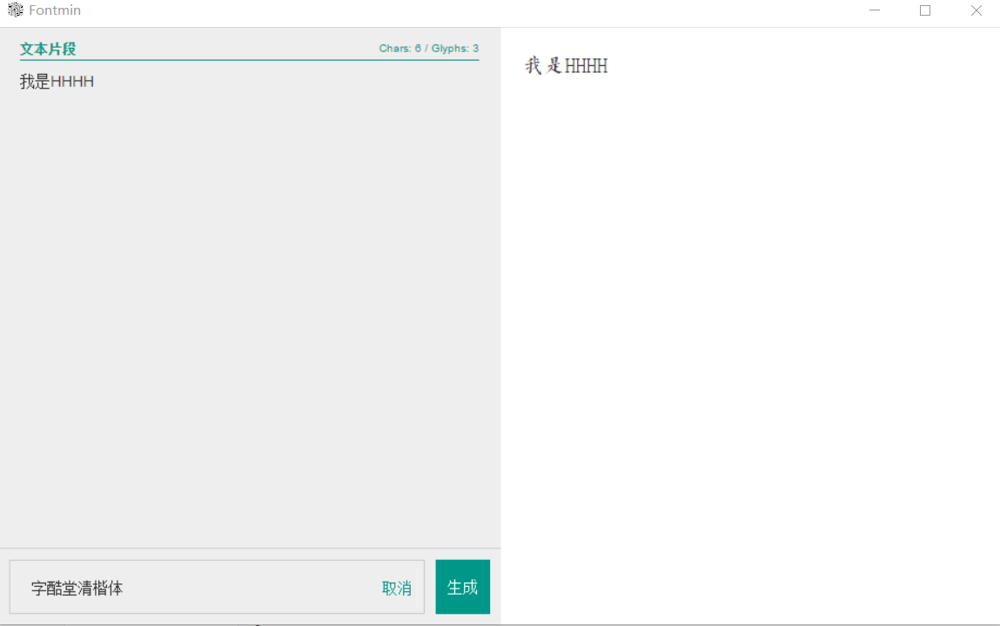

## 一、项目需求

1. 根据甲方要求，使用 UI 中指定字体
2. 移动端默认显示系统默认字体，非系统默认字体需要自行引入字体包
3. 问题：直接使用字体包过大，字体包通常在几 MB，严重拖累页面加载速度

**分析：**

1. 文本内容为固定内容，不需要更新
2. 文本内容大多为常用文字，大多文字用不上
3. 将需要的文字得该字体打包

## 二、css 引入字体

- 有些字体本身浏览器不携带，需下载字体包引入

```css
@font-face {
  font-family: "字体名称随便起";
  src: url("../font/字体名称.eot");
  src: url("../font/字体名称.woff") format("woff"), url("../font/字体名称.ttf")
      format("truetype"), url("../font/字体名称.svg") format("svg");
}
```

- **使用**，引入`.ttf`文件即可
- **提示：**字体 URL 始终使用小写字母。大写字母可能会在 IE 中产生意外结果。

```css
/*1.网络上下载需要的 .ttf 格式的语言包,在css导入:*/
@font-face {
  font-family: ZhanKuHeiTi;
  src: url("./font/zhankuheiti.eot"); /* IE9 */
  src: url("./font/zhankuheiti.eot?#iefix") format("embedded-opentype"), /* IE6-IE8 */
      url("./font/zhankuheiti.woff") format("woff"),
    /* chrome、firefox */ url("./font/zhankuheiti.ttf") format("truetype"), /* chrome、firefox、opera、Safari, Android, iOS 4.2+ */
      url("./font/zhankuheiti.svg#zhankuheiti") format("svg"); /* iOS 4.1- */
  font-style: normal;
  font-weight: normal;
}
/*2.需要的字体引用:*/
h1 {
  font: bold 30px ZhanKuHeiTi; /*简写,原font-family: ZhanKuHeiTi;*/
}
h1{
    font-family: wjs;
}
```

自定义字体图标，同理

```css
/*自定义字体图标*/
/*1.通过@font-face定义自己的字体*/
@font-face {
    /*2.申明自己的字体名称*/
    font-family: 'wjs';
    /*3.引入字体文件（约束某一段字符代码什么图案）*/
    src:
    url(../fonts/MiFie-Web-Font.svg) format('svg'),
    url(../fonts/MiFie-Web-Font.eot) format('embedded-opentype'),
    url(../fonts/MiFie-Web-Font.ttf) format('truetype'),
    url(../fonts/MiFie-Web-Font.woff) format('woff');
}
/*4.怎么使用维护性更好*/
.wjs_icon{
    font-family: wjs;
}
.wjs_icon_phone::before{
    content: "\e908";
}
```


## 三、软件-Fontmin

- 手动输入需要的文字，每次文字改变需要重新输入，繁琐。



## 四、插件-font-spider(**字蛛**)

- 执行命令行，可自动打包

**1、node 安装插件方法**

```cmd
#命令行，安装
npm install font-spider -g
```

**2、使用字体，提取项目文字**

```css
@font-face {
  font-family: ZiKuTangQingKaiTi;
  src: url("./font/zikutangqingkaiti.ttf") format("truetype");
  /* src:  url("./font/.font-spider/zikutangqingkaiti.ttf") format("truetype"); */
}
h3 {
  font: bold 60px ZiKuTangQingKaiTi;
  color: pink;
}
```

**3、将该目录下所有 html 使用到的字体抽离打包**

```cmd
#命令行
font-spider *.html
```

## 五、注意

- 如果页面文本内容需要经常更新
- 如果需要对 input 表单内容同样应用定制字体
- 那么请放弃本文章所述方法，可以考虑通过服务端渲染，动态生成字体包，或者，老老实实将完整的字体包引入页面。

> 参考：
> [node 字体压缩插件 font-spider](https://blog.csdn.net/weixin_34072458/article/details/88755474)


- 

