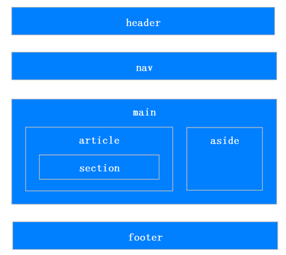

`<title>`     ：页面标题。
`<hn> `         ：h1~h6，分级标题，`<h1>` 与 `<title>` 协调有利于搜索引擎优化。`<ul>`          ：无序列表。
`<ol> `         ：有序列表。
`<header> `     ：页眉通常包括网站标志、主导航、全站链接以及搜索框。
`<nav> `        ：标记导航，仅对文档中重要的链接群使用。
`<main> `       ：页面主要内容，一个页面只能使用一次。如果是web应用，则包围其主要功能。
`<article>`    ：定义外部的内容，其中的内容独立于文档的其余部分。
`<section>`    ：定义文档中的节（section、区段）。比如章节、页眉、页脚或文档中的其他部分。
`<aside>`      ：定义其所处内容之外的内容。如侧栏、文章的一组链接、广告、友情链接、相关产品列表等。
`<footer>`     ：页脚，只有当父级是body时，才是整个页面的页脚。
`<small> `     ：呈现小号字体效果，指定细则，输入免责声明、注解、署名、版权。
`<strong> `    ：和 em 标签一样，用于强调文本，但它强调的程度更强一些。
`<em> `        ：将其中的文本表示为强调的内容，表现为斜体。
`<mark>`       ：使用黄色突出显示部分文本。
`<figure>`     ：规定独立的流内容（图像、图表、照片、代码等等）（默认有40px左右margin）。
`<figcaption>`：定义 figure 元素的标题，应该被置于 figure 元素的第一个或最后一个子元素的位置。
`<cite> `      ：表示所包含的文本对某个参考文献的引用，比如书籍或者杂志的标题。
`<blockquoto>` ：定义块引用，块引用拥有它们自己的空间。
`<q> `         ：短的引述（跨浏览器问题，尽量避免使用）。
`<time> `      ：datetime属性遵循特定格式，如果忽略此属性，文本内容必须是合法的日期或者时间格式。
`<abbr>`       ：简称或缩写。
`<dfn>`      ：定义术语元素，与定义必须紧挨着，可以在描述列表dl元素中使用。
`<address>`    ：作者、相关人士或组织的联系信息（电子邮件地址、指向联系信息页的链接）。
`<del> `       ：移除的内容。
`<ins>`        ：添加的内容。
`<code> `      ：标记代码。
`<meter> `     ：定义已知范围或分数值内的标量测量。（Internet Explorer 不支持 meter 标签）
`<progress>`    ：定义运行中的进度（进程）。

| **HTML5新增标签**                                  |                                                              |                                      |
| -------------------------------------------------- | ------------------------------------------------------------ | ------------------------------------ |
| 新的语义和结构元素                                 | `<section></section>`                                        | 定义文档中的主体部分的节、段。       |
| `<article></article>`                              | 一个特殊的section标签，比section有更明确的语义。定义来自外部的一个独立的、完整的内容块，例如什么论坛的文章，博客的文本。 |                                      |
| `<aside></aside>`                                  | 用来装载页面中非正文的内容，独立于其他模块。例如广告、成组的链接、侧边栏。 |                                      |
| `<header></header>`                                | 定义文档、页面的页眉。通常是一些引导和导航信息，不局限于整个页面头部，也可以用在内容里。 |                                      |
| `<footer></footer>`                                | 定义了文档、页面的页脚，和header类似。                       |                                      |
| `<nav></nav>`                                      | 定义了一个链接组组成的导航部分，其中的链接可以链接到其他网页或者当前页面的其他部分。 |                                      |
| `<hgroup></hgroup>`                                | 用于对网页或区段(section)的标题元素(h1~h6)进行组合。         |                                      |
| `<figure></figure>`                                | 用于对元素进行组合。                                         |                                      |
| `<figcaption></figcaption>`                        | 为figure元素加标题。一般放在figure第一个子元素或者最后一个。 |                                      |
| `

`                              | 定义元素的细节，用户可以点击查看或者隐藏。                   |                                      |
| `

`                              | 和details连用，用来包含details的标题。                       |                                      |
| `<mark></mark>`                                    | 在视觉上向用户展现出那些想要突出的文字。比如搜索结果中向用户高亮显示搜索关键词。 |                                      |
| `<progress></progress>`                            | 进度条，运行中的进度。                                       |                                      |
| `<time></time>`                                    | 定义日期或者时间。                                           |                                      |
| `<command></command>`                              | 定义命令行为。                                               |                                      |
| `<meter [min/max/low/high/optimum/value]></meter>` | 定义度量衡，仅用于已知最大和最小值的度量。                   |                                      |
| 新元素                                             | `<canvas></canvas>`                                          | 用来进行canvas绘图。                 |
| 新多媒体元素                                       | `<video></video>`                                            | 定义视频。                           |
| `<audio></audio>`                                  | 定义音频。                                                   |                                      |
| `<embed></embed>`                                  | 定义嵌入网页的内容。比如插件。                               |                                      |
| `<source></source>`                                | 该标签为媒介元素(比如video、audio)定义媒介元素。             |                                      |
| `<track>`                                          | 为诸如 `<video>` 和 `<audio>` 元素之类的媒介规定外部文本轨道。 |                                      |
| 新表单元素                                         | `<output></output>`                                          | 定义不同类型的输出，样式与span无异。 |
| `<keygen></keygen>`                                | 定义加密内容。                                               |                                      |
| `<datalist id='dl'></datalist>`                    | 定义可选数据的列表，与input配合使用(`<input list='dl'>`)可制作输入值的下拉列表。 |                                      |
| 已移除的元素                                       | `<acronym>、<applet>、<basefont>、<big>、
、<dir>、<frame>、<frameset>、<noframes>、<strike>、<tt>` |                                      |

| input新增类型  |                                                  |
| -------------- | ------------------------------------------------ |
| color          | 选择颜色                                         |
| date           | 选择日期                                         |
| datetime       | 选择一个日期（UTC 时间）                         |
| datetime-local | 选择一个日期和时间 (无时区)                      |
| email          | 用于检测输入的是否为email格式的地址              |
| month          | 选择月份                                         |
| number         | 用于应该包含数值的输入域，可以设定对输入值的限定 |
| range          | 用于定义一个滑动条，表示范围                     |
| search         | 用于搜索，比如站点搜索或 Google 搜索             |
| tel            | 输入电话号码                                     |
| time           | 选择一个时间                                     |
| url            | 输入网址                                         |
| week           | 选择周和年                                       |

优点：

- 让人更容易读懂（增加代码可读性）。
- 让搜索引擎更容易读懂，有助于爬虫抓取更多的有效信息，爬虫依赖于标签来确定上下文和各个关键字的权重（SEO）。
- 方便屏幕阅读器解析，如盲人阅读器根据语义渲染网页
- 有利于维护和开发，在没有 CSS 样式下，页面也能呈现出很好地内容结构、代码结构。

