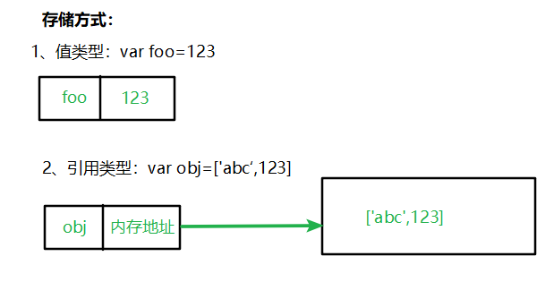
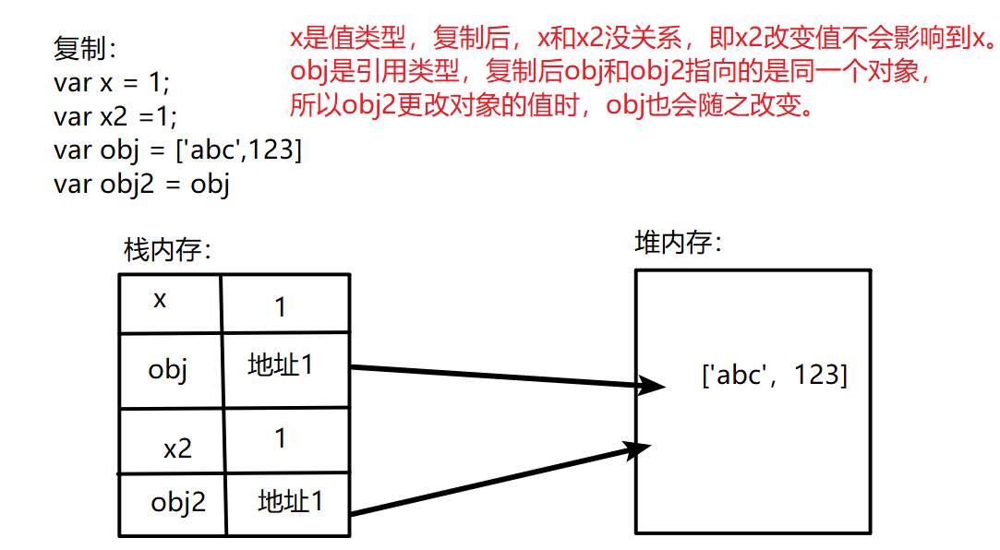
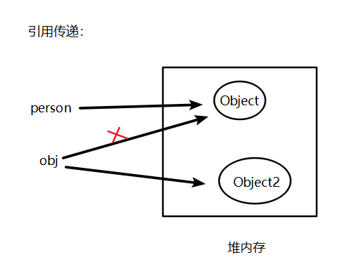

## 一、JS中的数据类型

JavaScript 有 5 种简单数据类型：`Undefined、Null、Boolean、Number、String` 和 1 种复杂数据类型 `Object` ，以及es6语法新增的Symbol、BigInt数据类型。

### 1.1.基本类型（值类型）

- Undefined、Null、Boolean、Number、String

### 1.2.复杂类型（引用类型）

- Object、Array、Date、RegExp、Function
- 基本包装类型：Boolean、Number、String
- 单体内置对象：Global、Math

==注：基本包装类型==

```
+ 普通变量不能调用属性或者方法， 对象可以直接调用属性和方法 
+ 基本包装类型：本身是基本类型，但是在执行代码的过程中，如果这种变量调用了属性或者方法，那么这种类型就不再是基本类型了，而是基本包装类型，这种变量页不再是普通变量了，而是基本包装类型对象。

+ 为了方便操作基本数据类型，JS还提供了三个特殊的引用类型：**String/Number/Boolean**
```

### 1.3.堆和栈

+ 栈：由操作系统自动分配释放 ，存放基本类型和复杂类型的地址。
+ 堆： 存储复杂类型(对象)，一般由程序员分配释放， 若程序员不释放，由垃圾回收机制回收，分配方式倒是类似于链表。
+ ==注==：JS中没有堆和栈的概念，此处我们用堆和栈来讲解。

## 二、JS类型检测方式

### 2.1.typeof：主要用于检测基本类型

+ typeof 需要检验的值

```js
typeof undefined;//=> undefined
typeof 'a';//=> string
typeof 1;//=> number
typeof true;//=> boolean
typeof {};//=> object
typeof [];//=> object
typeof function() {};//=> function
typeof null;//=> object,结果是object，原因在于，null类型被当做一个空对象引用
```

### 2.2.instanceof：主要用于检测引用类型

+ 对象 instanceof 函数

+ 根据对象的原形链往上找，如果原形链上有右边函数.prototype，返回true;否则返回false

```js
var obj = {}; obj instanceof Object; //=> true; 
var arr = []; arr instanceof Array; //=> true;
var fn = function() {}; fn instanceof Function; //=> true;
```

 ### 2.3.Object.prototype.toString.call()：

+ 由于原形链的检测有漏洞(原型是可以改变的)，所以会造成检测结果不准确，所以可以采用此种形式.

```js
var toString = Object.prototype.toString;
toString.call(undefined);//=> [object Undefined]
toString.call(1);//=> [object, Number]
toString.call(NaN);//=> [object, Number]
toString.call('a');//=> [object, String]
toString.call(true);//=> [object, Boolean]

toString.call({});//=> [object, Object]
toString.call(function() {});//=> [object, Function]
toString.call([]);//=> [object, Array]
toString.call(null);//=> [object, Null]
```

## 三、值类型和引用类型在内存中的存储方式

- 值类型按值存储
- 引用类型按引用存储，存储的不是值，而是一个地址



## 四、值类型复制和引用类型复制

- 值类型按值复制
- 引用类型按引用复制



```js
var x = 1
var x2 = x
x2=2
console.log(x) //1
console.log(x2) //2

var obj = ['abc',123]
var obj2 = obj
obj2[0]='a'
console.log(obj) //["a", 123]
console.log(obj2)  //["a", 123]
```

**注：**

+ x是值类型，复制后，x和x2没关系，即x2改变值不会影响到x。
+ obj是引用类型，复制后obj和obj2指向的是同一个对象，所以obj2(obj)更改对象的值时，obj(obj2)也会随之改变。

### 4.1.深拷贝和浅拷贝

[深拷贝和浅拷贝]()

## 五、值类型和引用类型参数传递

- 值传参针对基本类型，引用传参针对引用类型，传参可以理解为**复制变量值**。

**值类型参数传递**：基本类型复制后俩个变量完全独立，之后任何一方改变都不会影响另一方。

```js
function addTen(num) {
    num += 10;
    return num;
}
var count = 20;
var result = addTen(count);  //按值传递 num = count
console.log(count);  // 20, 没变化
console.log(result);  // 30
```

**引用类型参数传递**：引用类型复制的是引用（即指针），之后的任何一方改变都会映射到另一方。

```js
function setName(obj) {
    obj.name = "Nicholas";
    obj = new Object(); //改变obj的指向，此时obj指向一个新的内存地址，不再和person指向同一个
    obj.name = "Greg";
}
var person = new Object();
setName(person);   // 按引用传递，obj = person
console.log(person.name);   // "Nicholas" 
```



## 六、值类型与引用类型的差别

- 基本类型在内存中占据固定大小的空间，因此被保存在栈内存中
- 从一个变量向另一个变量复制基本类型的值，复制的是值的副本
- 引用类型的值是对象，保存在堆内存
- 包含引用类型值的变量实际上包含的并不是对象本身，而是一个指向该对象的指针
- 从一个变量向另一个变量复制引用类型的值的时候，复制是引用指针，因此两个变量最终都指向同一个对象


## 七、数据类型转换

### **7.1.转换成字符串类型**

- **.toString()**  变量有意义使用.toString()使用转换，如null 没意义报错

  ```js
  var num = 5;
  console.log(num.toString());//"5"
  ```

- **String()**， null 不会报错。存在的意义：有些值没有toString()，这个时候可以使用String()。比如：undefined和null

  ```js
  String(null);//"null"
  String(undefined);//"undefined"
  ```

- 拼接字符串方式

  num  +  ""，当 + 两边一个操作符是字符串类型，一个操作符是其它类型的时候，会先把其它类型转换成字符串再进行字符串拼接，返回字符串
  
- **join()**：把数组转字符串，使用分隔符分隔每一项。**不会改变原数组，返回值是String类型**

  ```js
  var arr = ['a','b','hhh']; 
  arr.join(); //=>"a,b,hhh"
  arr.join('-'); //=>"a-b-hhh"
  ```


### **7.2.转换成数值类型**

- **Number()**，可以把任意值转换成数值，如果要转换的字符串中有一个不是数值的字符，返回NaN

  ```js
  Number('.22');//0.22
  Number('11.22');//11.22
  Number('1.22s');//NaN
  Number('s');//NaN
  ```

- **parseInt()** ，把字符串转换成整数

  ```javascript
  parseInt("12.3abc");  // 返回12，如果第一个字符是数字会解析直到遇到非数字结束
  parseInt("abc123");   // 返回NaN，如果第一个字符不是数字或者符号就返回NaN
  ```

- **parseFloat()**，把字符串转换成浮点数

  ```js
  parseFloat("12.3abc");  // 12.3
  parseFloat("abc123"); //NaN
  parseFloat("0.1abc123"); //0.1
  ```

- +，-0等运算

  ```javascript
  var str = '500';
  console.log(+str);//500, 取正
  console.log(-str);//-500 取负
  console.log(str - 0); //500
  ```

### **7.3.转换成布尔类型**

- **Boolean()**，0  、''(空字符串) 、null、 undefined、 NaN 会转换成false，其它都会转换成true

  ```js
  Boolean(NaN );//false
  ```

  


