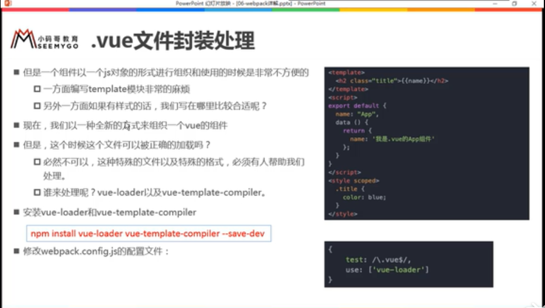

一.邂逅后Vuejs

### 1.1.认识Vuejs

+ 为什么学习Vuejs：Vuejs前端必备的一个技能
+ Vue的渐近式
  + 可以将vue作为应用的一部分嵌入
  + 如果希望将更多的业务逻辑使用vue实现，那么vue的核心库及生态系统
+ Vue的特点，很多特点和web开发中常见的高级功能：
  + 解藕视图和数据
  + 可复用的组件
  + 前端路由技术
  + 状态管理
  + 虚拟DOM
+ vue全家桶： VueCore+vue-router+vuex 

### 1.2.安装Vue

+ CDN引入，选择就近的服务器
+ 下载引入
+ npm安装

### 1.3.Vue的初体验

+ hello Vuejs
  + mustache->体验vue响应式。

+ Vue列表展示
  + v-for
  + 后面给数组追加元素的时候，新元素也可以在界面中渲染出来           

+ Vue计数器小案例
  + 事件监听：click->methods

### 1.4.Vue中的MVVM

+ view：dom
+ viewModel：vue实例 ,数据绑定（model数据绑定在view里,响应式，最新）， vue指令事件响应绑定到model，对dom界面做监听，回调model函数
+ model:js

### 1.5.创建Vue时，opction可以放哪些东西

+ el:
+ data:
+ methods:
+ 生命周期(钩子函数hook)：事务诞生到消亡的过程

## 二.插值语法及相关指令

+ mustache：{{}}，mustache语法中，不仅仅可以写变量，也可以写就简单的表达式

+ v-once：第一次展示出来，之后message改变，不会变

+ v-html：可以解析标签

+ v-text：不可以解析标签，

+ v-pre :告诉vue不要解析这个节点内部的内容，让浪费时间

+ v-cloak:斗篷，解决表达式闪烁的问题

  ```html
  <!--1.v-text:使用{{}}的比较多，如果都使用v-text又比较麻烦-->
  <div id="app" v-cloak>
     <span v-text="msg"></span>
  </div>
  <!--2.v-clock:来控制代码要不要显示
       在vue解析之前，div中有一个属性v-clock;
       在vue解析之后，div中没有一个属性v-cloak-->
  <style>
      [v-cloak]{
        display: none;
      }
  </style>
  <div id="app" v-cloak>{{message}}</div>
  
  ```

## 三.v-bind(语法糖：)

### 3.1.v-bind绑定基本属性

+ v-bind:src

+ :href

  ```HTML
   <a  :href="aHref">百度一下</a>
   <a  v-bind:href="aHref">百度一下</a>
  ```

### 3.2.v-bind动态绑定class

+ 对象语法：v-bind: class="{类名变量1:boolean,类名变量2:boolean}"

  ```html
   <h2 class="title" :class="{'active':isActive,'line':isLine}">{{message}}</h2>
   <!--过于复杂，可以放在一个methods或者computed中-->
   <h2 class="title" :class="getClasses()">{{message}}</h2>
    <script>
      const app=new Vue({
        el:'#app',
        data:{
           message:'你好啊',
          isActive:true,
          isLine:true
        },
        methods:{
          getClasses(){
            return {active:this.isActive,line:this.isLine}
          }
        }
      });
    </script>
  ```

+ 数组语法:  v-bind: class="[类名变量1,类名变量2]" 

  ```html
   <h2 class="title" :class="['active','line']"> {{message}}</h2>
  <!--不加双引号是变量-->
  <h2 class="title" :class="[active,line]"> {{message}}</h2>
  <h2 class="title" :class="getClasses()"> {{message}}</h2>
   <script>
      const app=new Vue({
        el:'#app',
        data:{
           message:'你好啊',
           active:'aaaa',
           line:'bbbb'
        },
        methods:{
          getClasses(){
            return [this.active,this.line]
          }
        }
      });
    </script>
  ```

### 3.3.v-bind动态绑定style

+ 对象语法: v-bind:style="{key(css属性名)：value(属性值变量)}"

  ```html
  <h2 :style="{fontSize:'50px'}">{{message}}</h2>
  <h2 :style="{fontSize:fontSize+'px',color:finalColor}">{{message}}</h2>
  <h2 :style="getStyles()">{{message}}</h2>
    <script>
      const app=new Vue({
        el:'#app',
        data:{
           message:'你好啊',
          fontSize:100,
          finalColor:'red'
        },
        methods:{
          getStyles(){
            return {fontSize:this.fontSize+'px',color:this.finalColor}
          }
        }
      });
    </script>
  ```

+ 数组语法:  v-bind:style="[style属性值变量1,style属性值变量2]"

  ```html
  <h2 :style="[baseStyle,baseStyle1]">{{message}}</h2>
  <script>
      const app=new Vue({
        el:'#app',
        data:{
           message:'你好啊',
          baseStyle:{backgroundColor:'red'},
          baseStyle1:{fontSize:'100px'}
        }
      });
  </script>
  ```

## 四.计算属性 computed

### 4.1.案例一：firstName+lastName

```html
 <div id="app">
   <!--1.插值法：直接拼接：语法过于繁琐-->
   <h2>{{firstName+' '+lastName}}</h2>
   <!--2.方法：通过定义methods， 显示4次的化话，函数会调用4次-->
   <h2>{{getFullName()}}</h2>
   <!--3.计算属性：通过computed  显示4次，计算属性只会调用1次，性能更高，有缓存-->
   <h2>{{fullName}}</h2>
 </div>
 <script>
   const app=new Vue({
     el:'#app',
     data:{
       firstName:'Lebron',
       lastName:'James'
     },
     //计算属性，按属性的方式
     computed:{
       fullName(){
         return this.firstName+' '+this.lastName
       }
     },
     methods:{
       getFullName() {
         return this.firstName+' '+this.lastName
       }
     }
   });
 </script>
```

### 4.2.案例二：books->price

```html
<div id="app">
     <h2>总价格：{{totalPrice}}</h2>
</div>
<script>
    const app=new Vue({
        el:'#app',
        data:{
            books:[
               {id:110,name:'Unix编程艺术',price:119},
               {id:111,name:'代码大全',price:110},
               {id:112,name:'深入理解计算机原理',price:200},
               {id:113,name:'现在操作系统',price:98}
             ]
        },
        methods:{
            getTotalPrice(){
                //如果是方法的话每次执行都得调用，性能差
                let result=0;
                for (let i =0;i<this.books.length;i++){
                    result=result+this.books[i].price
                }
                return result;
            },
        },
        computed:{
            totalPrice(){
                let result=0;
                // for (let i =0;i<this.books.length;i++){
                //   result=result+this.books[i].price
                // }
                // for (let i in this.books) {
                //   result=result+this.books[i].price
                // }
                for (let book of this.books) {
                    result=result+book.price
                }
                return result;
            }
        }
    });
</script>
```

### 4.3. 计算属性的本质

+ fullname:{get(){},set(){}}

  ````html
  <h2>{{fullName}}</h2>
  <script>
      const app=new Vue({
        el:'#app',
        data:{
           firstName:'Kobe',
          lastName:'Nryant'
        },
        computed:{
          //只有get方法时的简写
          // fullName(){
          //   return this.firstName+' '+this.lastName
          // },
          fullName:{
             //set一般有参数,给fullName设置值
             set(newValue){
               //this.firstName='213333333333333';
                 //输入：app.fullName='Lebron James'
               console.log('------'+newValue);//-----Lebron James）
               const names=newValue.split(' ');
               this.firstName=names[0];//Lebron
               this.lastName=names[1];// James
             },
            get(){
              return this.firstName+ James' '+this.lastName
            }
          }
        }
      });
    </script>
  ````

  

## 五.事件监听 v-on(语法糖@)

###  5.1. 事件监听基本使用

+ @click="方法名"

### 5.2.  参数问题

+ btnClick =====>btnClick(event)

+ btnClick(abc,$event) ->btnClick(abc,event)

+ 无参，'()'可以不添加。

  ```html
  <button @click=" btn1Click()">按钮1</button>
  <button @click=" btn1Click">按钮2</button>
  ```

+ 在事件定义时，写方法时省率了小括号，但是方法本身时需要一个参数的,这个时候vue默认将浏览器生成的event事件对象作为参数传入到方法中

  ```html
  <!--事件没有参-->
  <button @click="btn2Click">按钮5</button>  
  <script>
  const app=new Vue({
        el:'#app',
        methods:{
          btn2Click(event) {//方法需要参，默认传过来的是浏览器生成的event事件对象
            console.log('----------'+event);
          },
        }
      });
  </script>
  ```

+ 方法定义时，我们需要event对象，同时又需要其他参数。在调用方法时，如何手动的获取浏览器参数的event对象：$event

  ```html
  <!--需要event对象，同时又需要其他参数-->
  <button @click="btn3Click(123,$event)">按钮8</button>
  <script>
  const app=new Vue({
        el:'#app',
        methods:{
          btn3Click(abc,event) {//接收参数
            console.log('----------'+event);
          },
        }
      });
  </script>
  ```

+ 如果函数需要参数，但是没有传入，那么函数(方法)的形参为undefined

###  5.3 修饰符

+ .stop：  阻止冒泡 event.stopPropagation()

+ .prevent ：阻止默认事件 event.preventDefault()

+ .监听某个键盘的键帽： 如.enter，监听回车

  ```html
  <input type="text" @keyup.enter="keyUp">
  ```

+ .once ：只触发一次

+ .native： 监听组件根元素的原生事件

## 六.条件判断

###  6.1. v-if/v-else-if/v-else

```html
<div id="app">
    <!--不推荐这样使用，用计算属性-->
    <h2 v-if="score>=90">优秀</h2>
    <h2 v-else-if="score>=80">良好</h2>
    <h2 v-else-if="score>=60">及格</h2>
    <h2 v-else>不及格</h2>
     <!--用计算属性-->
    <h1>{{result}}</h1>
</div>
<script>
    const app=new Vue({
      el:'#app',
      data:{
        score:99
      },
      computed:{
        result(){
          let showMessage="";
          if(this.score>=90){
            showMessage="优秀";
          }else if(this.score>=80){
            showMessage="良好";
          }else if(this.score>=60){
            showMessage="及格";
          }else{
            showMessage="不及格";
          }
          return showMessage;
        }
      }
    });
</script>
```

###  6.2. 登录小案例（虚拟dom小问题）

```html
<div id="app">
    <span v-if="isUser">
        <label for="username"> 用户账号</label>
        <input type="text" id="username" placeholder="用户账号" key="username">
    </span>
    <span v-else>
        <label for="email"> 用户邮箱</label>
        <input type="text" id="email" placeholder="用户邮箱" key="email">
    </span>
    <button @click="isUser=!isUser">切换类型</button>
</div>
<script src="../js/vue.js"></script>
<script>
    const app=new Vue({
        el:'#app',
        data:{
            isUser:true
        }
    });
</script>
```

+ 切换了,但是input的东西没有清掉  ,虚拟dom的作用,直接复用之前的label和input,不会清空用户的输入
+ 解决加个key,key相同复用,不同不复用

###  6.3. v-show和v-if区别

+ v-if：当我们条件为false时,包含v-if指令的元素,根本不会存在dom中
+ v-show：当条件为false时,v-show只是给我们的元素添加了一个行内样式:display:none
+ 显示隐藏频繁切换--v-show
+ 当只有一次切换--v-if      (服务器传过来的数据决定某一大段dom要不要渲染,没有数据就不要渲染)

## 七.循环遍历v-for

### 7.1. 遍历数组

+ v-for,重新渲染出虚拟dom,然后根据虚拟DOM对真实的dom进行修改

```html
<!--1.遍历的过程中,没有使用索引值(下标值)-->
<li v-for="item in names">{{item}}</li>
<!--2.遍历的过程中,获取索引值(下标值)-->
<li v-for="(item,index) in names">{{index+1}}.{{item}}</li>

<script>
    const app=new Vue({
        el:'#app',
        data:{
            names:['why','hhh','lll','OOO']
        }
    });
</script>
```

### 7.2.遍历对象

```html
<!--1.value:在遍历对象的过程中.如果只是获取一个值,那么获取到的是value-->
<li v-for="item in info">{{item}}</li>
<!--2.获取key和value-->
<li v-for="(value,key) in info">{{key}}-{{value}}</li>
<!--3.获取key和value和index-->
<li v-for="(value,key,index) in info">{{key}}-{{value}}-{{index}}</li>

<script>
    const app=new Vue({
      el:'#app',
      data:{
         info:{
           name:'why',
           age:18,
           height:1.88
         }
      }
    });
</script>
```

### 7.3.v-for使用过程添加key

+ key要保证跟展示的东西一一对应,唯一性,在中间插入元素就不用位移位移
+ 使用v-for,给对应的元素或组件添加上一个:key属性  ，与虚拟dom有关,更好的复用.达到性能利用
+ 主要作用:为了高效更新虚拟DOM

```	html
<li v-for="item in letters" :key="item">{{item}}</li>
```

### 7.4.数组哪些方法是响应式的

+ push('添加元素','添加元素'…)----在数组最后面面添加元素

+ pop()---删掉数组中的最后一个元素

+ shift()--删掉数组中的第一一个元素

+ unshift('添加元素','添加元素'…)--在数组最前面添加元素

+ splice(start,deleteCount,...插入/追加的元素item)----删除/插入/替换

  + 删除元素:第二个参数传入你要删除几个元素,没传删除后面所有元素
  + 替换元素:第二个参数,表示我们要替换几个元素,后面是用于替换前面的元素
  + 插入元素:第二个参数是0,并且后面跟上要插入的元素

+ sort()--排序,可以传入函数作为参数

  ```js
  //降序
  arr.sort(function(a,b){
  	return b - a;
  })
  //升序
  arr.sort(function(a,b){
  	return a - b;
  })
  ```

+ reverse()------反转

+ ##### 注意:通过索引值修改数组中的元素 -------无响应式

  ```js
  //letters:['a','b','c','d']
  this.letters[0]="bbb"; 
  console.log(this.letters)//["bbb", "b", "c", "d"],但页面的值没变
  //  要用:this.letters.splice(0,1,'bbb')------------推荐
  //  或用:Vue.set(要修改的对象,索引值,修改后的值);
  ```

### 7.5.小案例：实现点哪个li，哪个变红

```html
<li v-for="(item,index) in movies" :class="{active:index==currentIndex}" @click="liClick(index)">{{item}}</li>
<script>
    const app=new Vue({
      el:'#app',
      data:{
        movies:['111','222','333','444'],
        currentIndex:0
      },
      methods:{
        liClick(index){
          this.currentIndex=index;
        }
      }
    });
</script>
```

## 八.书籍案例

```html
<!--
   需求：给价格加上‘¥’符号，并保留两位小数
    方法1:{{'¥'+item.price.toFixed(2)}}
    方法2:{{getFinalPrice(item.price)}} 定义一个方法中做处理
    方法3：{{item.price|过滤器}}  ===》{{item.price|showPrice}}
-->
<script>
const app = new Vue({
  el: '#app',
  data: {
      books: [{id: '1',name: 'AAAAA',date: '2012-1',price: 110.10,count: 1},
              {id: '2',name: 'BBBBB',date: '2012-2',price: 120.55,count: 1},
              {id: '3',name: 'CCCCC',date: '2012-3',price: 130,count: 1},
              {id: '4',name: 'DDDD',date: '2012-4',price: 140.00,count: 1},]
  },
  methods:{
    getFinalPrice(price){
      return '¥'+price.toFixed(2);
    },
   //1、直接this.books[index],页面的值不会改变。this.books[index].name='HHHHHHH'会改变
    decrement(index){
      // this.books[index]={
      //   id: '2',
      //   name: 'BBBBB',
      //   date: '2012-2',
      //   price: 120.55,
      //   count: 1
      // };
      // console.log(this.books);//-------------值有变,但页面不会变
     //this.books[index].name='HHHHHHH';
      // console.log(this.books);//-------------值有变页面也会变
        this.books[index].count--
    }
    increment(index){
         this.books[index].count++
    },
    removeHandle(index){
      this.books.splice(index,1);
    }
  },
  computed:{
    totalPrice(){
      // let totalPrice=0;
      //1.普通for循环
      // for (let i=0;i<this.books.length;i++){
      //   totalPrice+=this.books[i].price*this.books[i].count;
      // }
      //2.for (let i in this.books)
      // for (let i in this.books){
      //   totalPrice+=this.books[i].price*this.books[i].count;
      // }
      //3.for (let book  of this.books)
      // for (let book of this.books){
      //   totalPrice+=book.price*book.count;
      // }
      // return totalPrice;
      return this.books.reduce((preValue,book) =>preValue+book.price*book.count,0);
    }
  },
  //过滤器
  filters:{
    showPrice(price){
      return '¥'+price.toFixed(2);
    }
  }
});
</script>
```

+ filter()，map()，reduce()

```js
需求：从nums筛选出小于100的数进行乘2求后求和
const nums=[10,20,111,222,444,40,50];
//1.filter中的回调函数有个要求:必须返回一个boolean值
//  为true:当返回true时,函数内部会自带将这次回调的n加入到新的数组中
//  为false:当返回为false时,函数内部会过滤掉这次的n
 let newNum=nums.filter(function (n,index,arr) {
    return n<100
 });
 console.log(newNum);//[10,20,40,50]

//2.map函数的使用------对数组里的数进行变化
//  函数返回的值会作为新的值加入到新的数组中
 let new2Num=newNum.map(function (n) {
    return n*2
 });
console.log(new2Num);//[20,40,80,100]

//filter、map回调函数的参数---第一个参数currentValue：当前元素的值；第二个参数index：当前元素的索引值；第三个参数arr：当前元素属于的数组对象


//3. reduce函数的使用---对数组总所有内容进行汇总
//   reduce（回调函数,初始值);
//   回调函数的参数---第一个参数preValue:初始值或上一次返回的值；第二个参数currentValue：当前元素；第三个参数currentIndex：当前元素的索引值；第三个参数arr：当前元素属于的数组对象
 new2Num.reduce(function (preValue,n) {
    return 100
 },0);
//第一次： preValue 0                n 20
//第二次： preValue 100（return的值）  n 40
//第三次： preValue 100（return的值）  n 80
//第四次： preValue 100（return的值）  n 100
 let total=new2Num.reduce(function (preValue,n) {
    return preValue+n
 },0);
console.log(total);//240
//第一次： preValue 0                n 20
//第二次： preValue 20（return的值）   n 40
//第三次： preValue 60（return的值）   n 80
//第四次： preValue 140（return的值）  n 100
//第五次： return 240


let total=nums.filter(n=>n<100).map(n=>n*2).reduce((preValue,n)=>preValue+n,0);
console.log(total);//240


//1.需求:取出所有小于100的数字
let newNum=[];
for (let n of nums){
  if (n<100){
    newNum.push(n);
  }
}
// 2.将所有小于100的数字进行转换:全部乘以2
let new2Num=[];
for (let n of newNum){
    new2Num.push(n*2);
}
//3.需求:将所有new2Nums数字相加,得到最终的记过
let total=0;
for (let n of new2Nums){
  total+=n;
}


```

+ 编程范式:命令式编程/声明式编程

  编程范式:面向对象编程(第一公民:对象)/函数式编程(第一公民:函数)

## 九. v-model的使用

+ 本质的语法糖是：input等元素上是value属性+input事件；checkbox和radio使用checked属性+change事件

### 9.1.v-model的基本使用

+ v-model=>v-bind:value  v-on:input  (v-model也可以用在textarea)

  ```html
  <!--
       原理：
       1、v-bind绑定一个value属性
       2、v-on指令给当前元素绑定input事件
   -->
  <input type="text" :value="你好啊" @input="valueChange">
  <input type="text" :value="你好啊" @input="message=$event.target.value">
  <script>
      const app=new Vue({
          el:'#app',
          data:{
              message:'你好啊'
          },
          methods:{
              valueChange(e){
                  this.message=e.target.value;
              }
          }
      });
  </script>
  ```

### 9.2.v-model和radio/checkbox/select

```html
<!--1、radio-->
<div id="app">
    <!--有label可以点文字也可以，for和id要一样-->
    <label for="male">
        <!--加上name才能互斥，但是两个都绑定了一个sex name可以去掉-->
        <!--<input type="radio" id="male" name="sex" value="男" v-model="sex">男-->
        <input type="radio" id="male" value="男" v-model="sex">男1
    </label>
    <label for="fmale">
        <!--<input type="radio" id="fmale" name="sex" value="女" v-model="sex">女-->
        <input type="radio" id="fmale"  value="女" v-model="sex">女2
    </label>
    <h2>{{sex}}</h2> 
</div>
 <!--2.checkbox-->  
<div id="app">
    <!--2.1.checkbox单选框-->
    <label for="agree">
        <input type="checkbox" id="agree" v-model="isAgree">同意协议
    </label>
    <h2>您选择的是：{{isAgree}}</h2>
    <button :disabled="!isAgree">下一步</button>

    <!--2.2.多选框-->
    <label for="">
        <input type="checkbox"   value="11111" v-model="hobbies">111
    </label>
    <label for="">
        <input type="checkbox"   value="222"  v-model="hobbies">222
    </label>
    <label for="">
        <input type="checkbox"   value="333" v-model="hobbies">333
    </label>
    <label for="">
        <input type="checkbox"   value="444" v-model="hobbies">444
    </label>
    <h2>您选择的爱好是：{{hobbies}}</h2>

    <!--值绑定 就是值不是写死的   v-bind -->
    <label v-for="item in originHobbies" :for="item">
        <input type="checkbox" :value="item" :id="item" v-model="hobbies">{{item}}
    </label>
</div>
<script>
  const app=new Vue({
    el:'#app',
    data:{
      message:'你好啊',
      isAgree:false,  //单选框用布尔值
      hobbies:[], //多选框用数组
      originHobbies:['111','222','333','444','555','6666']
    }
  });
</script>
<!--3、select-->
 <div id="app">
    <!--1、选择一个-->
    <select name="abc" id="" v-model="fruit">
      <option value="苹果1">苹果</option>
      <option value="香蕉1">香蕉</option>
      <option value="梨1">梨</option>
      <option value="葡萄1">葡萄1</option>
    </select>
    <h2>您选择的是:{{fruit}}</h2>
    <!--2、选择多个  加上multiple可以选择多个-->
    <select name="abc"  v-model="fruits" multiple>
      <option value="苹果1">苹果</option>
      <option value="香蕉1">香蕉</option>
      <option value="梨1">梨</option>
      <option value="葡萄1">葡萄1</option>
    </select>
    <h2>您选择的是:{{fruits}}</h2>
  </div>
  <script>
    const app=new Vue({
      el:'#app',
      data:{
         message:'你好啊',
        fruit:"香蕉1",//单选是字符串
        fruits:[],     //多选是数组
      }
    });
  </script>
```

### 9.3.修饰符

+ lazy：失去焦点或回车的时候再进行数据更新

+ number：number类型，默认v-model赋值都是String类型

+ trim：去空格

  ```html
  <input type="text" v-model.lazy="message">
  <h2>{{message}}</h2>
  
  <input type="number" v-model.number="age">
  <h2>{{age}}--{{typeof age}}</h2>
  
  <input type="text" v-model.trim="name">
  ```

## 十.组件化开发

### 10.1.认识组件化

### 10.2.组件的基本使用

```html
<div id="app">
  <!--3、使用组件-->
  <my-cpn></my-cpn>
  <my-cpn></my-cpn>
</div>
<script>
    //1.创建组件构造器
    const cpnC= Vue.extend({
        template:`
               <div>
                <h2>我是标题</h2>
                <p>我是内容，哈哈哈</p>
                <p>我是内容，呵呵呵呵呵呵呵</p>
               </div>
          `
    })
    //2、注册组件 Vue.component('组件的标签名',组件构造器)
    Vue.component('my-cpn',cpnC);
    //3、使用组件
    const app=new Vue({
        el:'#app'
        data:{
        message:'你好啊'
       }
    })
</script>
```

### 10.3.全局组件和局部组

```js
//1、创建组件构造器
const cpnC=Vue.extend({
    template:`<div>
                <h2>我是标题</h2>
                <p>我是内容，呵呵呵呵呵呵呵</p>
               </div>`
});
//2、注册组件（全局组件,意味着可以再多个vue的实例下面使用）
// Vue.component('cpn',cpnC);
//疑问：怎么样注册的组件才是局部组件
const app=new Vue({
    el:'#app',
    data:{
        message:'你好啊'
    },
    //2、注册组件（局部组件，要挂载在vue实例下面，只有这个实例下可以用）
    components:{
        // cpn使用组件时的组件名，cpnC组件构造器
        cpn:cpnC
    }
});
const app2=new Vue({
    el:'#app2',
    data:{
    }
});
```

### 10.4. 父组件和子组件

```html
<div id="app">
  <cpn2></cpn2>
</div>
<script>
    // 1、创建第一个组件构造器（子组件）
    const cpnC1=Vue.extend({
        template:` <div>
                    <h2>我是标题1</h2>
                    <p>我是内容，哈哈哈</p>
                   </div>  `
    });
    // 1、创建第二个组件构造器  (父组件)--vue里被渲染成render函数
    const cpnC2=Vue.extend({
        template:`<div>
                    <h2>我是标题2</h2>
                    <p>我是内容，呵呵呵呵呵呵呵</p>
                    <cpn1></cpn1>
                  </div>`,
        components:{
            cpn1:cpnC1,
        }
    });

    //父子组件的错误用法，以子标签的形式在vue实例中使用
    //vue实例可以看成一个组件---root组件
    const app=new Vue({
        el:'#app',
        data:{
            message:'你好啊'
        },
        components:{
            cpn2:cpnC2
        }
    });
</script>
```

### 10.5.注册的语法糖

+ 全局组件注册的语法糖 Vue.component('组件标签名',构造器对象)

```js
// 1、创建全局组件构造器
const cpn1=Vue.extend({
    template:`
    <div>
       <h2>我是标题2</h2>
       <p>我是内容，呵呵呵呵呵呵呵</p>
    </div>
    `
});
//2、注册组件
Vue.component('cpn',cpn1);
//==================================================》
//语法糖
Vue.component('cpn1',{
      template:`
       <div>
          <h2>我是标题1</h2>
          <p>我是内容，呵呵呵呵呵呵呵</p>
       </div>
        `
});
```

+ 注册局部组件语法糖

```js
// 1、创建全局组件构造器
const cpn2=Vue.extend({
    template:`
    <div>
       <h2>我是标题2</h2>
       <p>我是内容，呵呵呵呵呵呵呵</p>
    </div>
    `
});
//=======================================================>
//语法糖
const app=new Vue({
    el:'#app',
    data:{
        message:'你好啊'
    },
    components:{
        //'cpn2':cpn2
        'cpn2':{
            template:`
            <div>
               <h2>我是标题2</h2>
               <p>我是内容，呵呵呵呵呵呵呵</p>
            </div>
            `
        }
    }
});
```

### 10.6. 模板的分类写法

+ script标签，注意：类型必须是text/x-template

  ```html
  <script type="text/x-template" id="cpn">
      <div>
        <h2>我是标题</h2>
        <p>我是内容，哈哈哈哈哈哈哈哈哈哈</p>
      </div>
  </script>
  ```

+ template标签

  ```html
  <template id="cpn">
      <!--子组件很多标签，必须有个根节点-->
      <div>
        <h2>我是标题</h2>
        <p>我是内容，呵呵呵呵呵呵呵呵呵呵呵呵呵</p>
      </div>
  </template>
  <script>
    //全局组件  
      Vue.component('cpn',{
          template:'#cpn'
      });
  </script>
  ```

### 10.7. 数据的存放

+ 子组件不能之间访问父组件

  + 组件是一个单独功能模块的封装：这个模块有属于自己的html模板，也应该又属于自己的数据data

  + 组件中不能直接访问vue实例里的数据data，而且即使能访问，所有数据放在vue实例中，vue实例就会变得很臃肿

+ 子组件中有自己的data，而且必须是个函数，这个函数返回一个对象，对象内部保存这数据

+ 为什么必须是一个函数

  ```html
  <div id="app">
      <!--根据一个组件，创建出了3个组件实例对象-->
      <!--没有共享一个data对象，每次调用重新return一个对象，每次返回新的对象，没有相互影响-->
      <!--如果data是个对象是，组件1、2、3都是使用这个data这个对象，每次使用都会把所有的组件都被改变,会引起连锁反应-->
      <cpn></cpn>
      <cpn></cpn>
      <cpn></cpn>
  </div>
    <template id="cpn">
      <div>
        <div>当前计数：{{counter}}</div>
        <button @click="increment">+</button>
        <button  @click="decrement">-</button>
      </div>
  
    </template>
      <script>
      //1.注册组件
      // const obj={
      //     counter:0
      // };
      Vue.component('cpn',{
        template:'#cpn',
        data(){
          return {
            counter:0
          }
        },
        // data(){
        //   return obj
        // },
        methods:{
          increment(){
            this.counter++
          },
          decrement(){
            this.counter--
          }
        }
      });
      const app=new Vue({
        el:'#app',
        data:{
           message:'你好啊'
        }
      });
    </script>
  
  
  
    <script>
      const obj={
        name:'hhh',
        age:18
      };
      function abc() {
        return {      //  不是同一个对象，每次都会在栈空间里创建很多新的变量 内存地址不一样
          name:'hhh',
          age:18
        }
        // return obj;   //是同一个对象,内存地址一样
      }
      let obj1=abc();
      let obj2=abc();
      let obj3=abc();
      obj1.name='kobe';
      console.log(obj1);
      console.log(obj2);
      console.log(obj3);
    </script>
  ```

### 10.8.父子组件的通信

+ 父传子：props

  + props对象形式：

  ```html
  <div id="app">
      <cpn :cmovies="movies" :cmessage="message"></cpn>
      <!--没有加v-bind 会直接传字符串 movies 和 message-->
      <!--<cpn cmovies="movies" cmessage="message"></cpn>-->
  </div>
  <template id="cpn">
      <div>
          <h2>{{cmessage}}</h2>
          <ul>
              <li v-for="movie in cmovies">{{movie}}</li>
          </ul>
      </div>
  </template>
  <script>
      const cpn={
          template:'#cpn',
          //一.props是数组形式
          // props:['cmovies','cmessage'],
          
          //二.props是对象形式
          props:{
              // 1、类型限制   String、Number、Boolean、Array、Object、Date、Function、Symbol
              // cmovies:Array,//传入的值必须是个数组
              // cmessage:String
              // 2、提供一些默认值,以及必传值
              cmovies:{
                  type:Array,//传入的值必须是个数组
                  // 原因：props default是数组/对象的默认值必须是一个函数  [],vue2.5.3以下不会错
                  // default:()=>['1','2','3'],//默认值，没传值时显示
                  default(){
                      return ['1','2','3']
                  },//默认值、没传值是显示
                  required:true//布尔值，为true是表示必须传
                  //还可以自己写验证
                  //   validator:function (value) {
                  //     //这个值必须匹配下列字符串的一个
                  //     return ['success','wraning','danger'].indexOf(value)!==-1
                  //     console.log(value);
                  //   }
              },
              cmessage:{
                  type:[String,Number],
                  default:'abcd',
                  // required:true,
                  validator:function (value) {
                      //这个值必须匹配下列字符串的一个
                      console.log(value);
                      return '你好啊222哈哈哈哈哈哈哈哈哈哈哈哈哈哈哈哈哈哈哈'.indexOf(value)!==-1
  
                  }
              },
          },
          data(){
              return{
  
              }
          }
      };
      //有自定义构造函数时，验证还支持自定义的类型
      // function Person(firstName,lastName) {
      //   this.firstName=firstName;
      //   this.lastName=lastName;
      // }
      // Vue.component('cpn',{
      //   props: {
      //     author:Preson
      //   }
      // });
  
      const app=new Vue({
          el:'#app',
          data:{
              message:'你好啊',
              movies:['海王','海贼王','海尔兄弟'],
          },
          components:{
              cpn
          }
      });
  </script>
  ```

  + props中的驼峰标识cInfo，v-bind 不支持驼峰cInfo  必须写c-info
  + props的数据要父组件对它进行修改,避免子组件对它进行修改,双向绑定不要绑定在props里

+ 子传父：$emit(自定义事件名字,自定义事件参数)

  ```html
  <!--父组件模板-->
  <div id="app">
    <!--父组件接收子组件发射的事件,要监听发射的item-click事件,用cpnClick进行处理-->
    <!--不能写驼峰标识@itemClick="cpnClick"-->
    <!--省略掉的参数是子组件传过来的参数-->
    <cpn @item-click="cpnClick"></cpn>
    <!--省略掉的参数是event-->
    <button @click="cpnClick"></button>
  </div>
  <!--子组件模板-->
  <!--子组件产生的事件，希望父组件知道  告诉父组件，发生了什么样的事件，现在发生事件产生对应的数据，父组件再根据子组件传过来的东西去请求新一轮的数据-->
  <template id="cpn">
    <div>
      <button v-for="item in categories" @click="btnClick(item)">{{item.name}}</button>
    </div>
  </template>
  <script>
    //1、子组件
    const cpn={
      template:'#cpn',
      data(){
        return{
          categories:[
            {id:'aaa',name:'热门推荐'},
            {id:'bbb',name:'手机数码'},
            {id:'ccc',name:'家用家电'},
            {id:'ddd',name:'电脑办公'}
          ]
        }
      },
      methods:{
        btnClick(item){
          //点击谁要告诉父组件
          // 自定义事件
          //发射事件:自定义事件  this.$emit(自定义事件名字,自定义事件参数)
          this.$emit('item-click',item);//子组件发射事件,父组件要接收事件
          // console.log(item);
        }
      }
    };
    //2、父组件
    const app=new Vue({
      el:'#app',
      data:{
        message:'哈哈哈哈哈哈哈哈哈哈哈哈哈'
      },
      components:{
        cpn
      },
      methods:{
        //处理子组件传过来的事件
        cpnClick(item){
          console.log('111233444',item)
        }
      }
    });
  </script>
  ```


### 10.9.项目

+ npm inatall
+ npm run serve

### 10.10.父子组件的访问

+ children/refs-----------父拿子组件的对象或方法，并操作它

  ```js
  //1.this.$children拿子组件的属性和方法,一般不通过这样拿
  console.log(this.$children);//返回所有的子组件对象的集合
  this.$children[0].showMessage();
  this.$children[1].showMessage();
  console.log(this.$children[0].name);
  //2.this.$refs=>对象类型,默认是个空的对象,要在组件上加属性ref,如ref="aaa"   -----------常用
      //<cpn ref="aaa"></cpn>
  console.log(this.$refs);
  console.log(this.$refs.aaa); //获取属性值为ref="aaa"的组件对象
  console.log(this.$refs.aaa.name);
  ```

+ parent/root------------- 子拿父组件的方法并操作 

  ```js
  //1.访问父组件 this.$parent ---------------不建议使用,使得组件复用性不是很强  一个父组件里有name这个属性,另一个父组件中可能没有
  console.log(this.$parent);
  console.log(this.$parent.name);
  
  //  2.访问根组件$root-------------也很少用,vue实例里面东西很少,基本什么东西都没有
  console.log(this.$root);
  console.log(this.$root.message);
  ```

### 10.11.slot的使用

+ 基本使用

  + `<slot></slot>`    vue2.6  中slot 废弃变成 `<v-slot></v-slot>`

  + 插槽的默认值 `<slot>button</slot>`

  + 如果有多个值,同时放入到组件进行替换时,一起作为替换元素

  + ```html
    <div id="app">
      <cpn><!--<button>按钮</button>--></cpn>
      <cpn><span>  hhh</span> </cpn>
      <cpn>
        <i>LLLL</i>
        <div>我是div</div>
        <p>我是p元素</p>
      </cpn>
      <cpn> <!--<button>按钮</button>--></cpn>
      <cpn> <!--<button>按钮</button>--></cpn>
      <cpn>
        <button>按钮1</button>
      </cpn>
    </div>
    <template id="cpn">
       <div>
         <h2>我是组件</h2>
         <p>我是组件,哈哈哈哈哈</p>
         <!--可能想显示span或button或其他的东西-->
         <!--slot显示啥你决定-->
         <slot>
           <!--没有传就显示默认的值-->
           <button>按钮</button>
         </slot>
       </div>
    </template>
    ```

+ 具名插槽------多个插槽要给插槽取名

  ```html
  <div id="app">
    {{message}}
    <cpn>
      <!--三个插槽只写一个,三个都会被替换掉 ,只会替换没名字的插槽-->
      <span>标题1</span>
      <span>标题2</span>
        
      <div slot="left" style="display: inline-block">
        <span>替换左边插槽的内容</span>
        <button >左边插槽按钮</button>
      </div>
      <span slot="center">替换中间插槽的内容</span>
    </cpn>
  </div>
  
  <template id="cpn">
    <div>
      <slot name="left"><span>左边</span></slot>  <!--替换左边插槽的内容 左边插槽按钮-->
      <v-slot name="center"><span>中间</span></v-slot><!--替换中间插槽的内容-->
      <slot name="right"><span>右边</span></slot><!--右边-->
      <slot>HHH</slot>      <!--标题1 标题2-->
      <v-slot>LLLLL</v-slot> <!--LLLLL-->
    </div>
  </template>
  ```

  + slot没有name会被没有slot的标签替换。
  + v-slot没有name不会被,没有slot的标签替换。

+ 编译作用域

  + 在哪个模板里就使用哪个模板的变量

+ 作用域插槽

  + 拿子组件的数据,在父组件中展示（父组件对子组件展示的数据不满意，以另外一种方式展示）

  ```html
  <div id="app">
   <!--默认显示-->
    <cpn ></cpn>
   <!--父组件不想像子组件那样默认显示,要先获取子组件展示的值-->
    <cpn>
      <!--目的：获取子组件中的pLanguage, vue2.5以下要写template标签-->
      <!--slot-scope="slot"  引用组件中的插槽对象-->
      <template slot-scope="slot">
        <!--slot.data  插槽对象的值-->
        <span>{{slot.data.join('-')}}</span>
      </template>
    </cpn>
    <cpn>
      <template slot-scope="slot">
        <span v-for="item in slot.data">{{item}}******</span>
      </template>
    </cpn>
  </div>
  
  <template id="cpn">
    <div>
     <!--data  可以随便命名-->
      <slot :data="pLanguage">
        <!--父组件不想按子组件中这么展示-->  
        <!--<ul>
          <li v-for="item in pLanguage">{{item}}</li>
        </ul>-->
      </slot>
    </div>
  </template>
  <script>
    const app=new Vue({
      el:'#app',
      data:{},
      components:{
        cpn:{
          template:'#cpn',
          data(){
            return{
              pLanguage:['JavaScript','C++','Java','#C','Python','Go','Swift']
            }
          }
        }
      }
    });
  </script>
  ```


## 十一.前端模块化

### 11.1.为什么要使用模块化

+ 简单写js代码带来的问题

  + 全局变量同名问题，使用闭包解决，变量同名问题，但是闭包又引起代码不可复用

+ 闭包引起代码不可复用

  + (function(){})();闭包解决了命名冲突的问题，但是造成了代码不可复用

+ 自己实现了简单的模块化

  ```js
  //aaa.js
  var mouldA=(function(){
      var obj={};
      
      var name ="小明";
      var age=22;
      function sum(num1,num2) {
          return num1+num2
      }
      var flag=true;
      if(flag){
          console.log(sum(10,20));
      }
      
      obj.flag=flag;
      obj.sum=sum;
      return obj;
  })();
  
  //bbb.js
  var mouduleB=(function(){
      var obj={};
      
      var name="小红";
      var flag=false;
     
      obj.flag=flag;
      return obj;
  })();
  
  //mmm.js
  (function () {
    //1.想使用aaa.js的flag
  
    if(mouldA.flag){
      console.log('小明是天才');
    }
    //2.想使用aaa.js的sum函数
     console.log( mouldA.sum(40,50));
  })();
  
  //nnn.js
  (function () {
    //想使用bbb.js的flag
    console.log('moduleB:'+mouduleB.flag)
  })();
  ```

+ AMD/CMD/CommonJS

  + Commonjs写法-----要webpack才能解析, webpack正常运行依赖于node环境，在node环境中可以写

    + 导出module.export

    + 导入require

      ```js
      //aaa.js
      var name ="小明";
      var age=22;
      function sum(num1,num2) {
       return num1+num2
      }
      var flag=true;
      if(flag){
       console.log(sum(10,20));
      }
      module.exports={
       flag:flag
       sum:sum
      }
      //mmm.js
      //commonJS写法导入
       var {flag,sum} =require('./aaa.js')//对象的结构
       console.log(flag);
       console.log(sum(20,30));
      //等价于==============>
      // var aaa =require('./aaa.js');
      // var flag=aaa.flag;
      // var sum=aaa.sum;
      //  sum(20,30);
      ```

    + js的规范写法，不加分号，分号只在{}，[]，反引号前面加

### 11.2.ES6中模块化的使用

+ export

+ export default

+ import

  ```js
  //aaa.js
  var name="小明";
  var age=18;
  var flag=true;
  function sum(num1,num2) {
    return num1+num2
  }
  if(flag){
    console.log(sum(30,20));
  }
  //1.导出方法一
  export {
      flag,sum
  }
  //2.导出方式二
  export var num1=1000;
  export var height=1.88;
  //3.导出函数/类
  export function mul(num1,num2){
      return num1*num2
  }
  export class Person{//es6的类；普通的类：function Person() {}
      run(){
          console.log('在奔跑');
      }
  }
  //4.export default，让使用者可以自己命名，只能有一个
  // const address="福州";
  // export {
  //   address
  // }
  export const address="福州";
  export default function (argument) {
    console.log(argument);
  }
  
  
  //mmm.js
  //1.导入的{}中定义的变量
  import {flag,sum} from "./aaa.js"
  if (flag){
    console.log('小明是天才');//100小明是天才
    console.log(sum(90,10));//100
  }
  //2.直接导入export定义的变量
  import {num1,height} from "./aaa.js";
  console.log(num1);  //1000
  console.log(height);//1.88
  //3.导入export的function/class
  import {mul,Person} from "./aaa.js";
  console.log(mul(999,2));//1998
  //创建对象
  const p=new Preson();
  p.run();//在奔跑
  // 4.导入export default中的内容
  // import {address} from "./aaa.js";
  import addr from "./aaa.js";
  console.log(addr);//福州
  import addrf from "./aaa.js";
  console.log(addrf);//function (argument) {console.log(argument);}
  addrf('您好啊');//您好啊
  //5.统一全部导入
  // 5.1.import {flag,num,num1,height,Preson,mul,sum} from "./aaa.js";
  //5.2.as取个别名
  import * as aaa from './aaa.js';
  console.log('============='+aaa.flag);
  ```

## 十二.webpack

### 12.1.什么是webpack

+ 静态模块打包工具

  + 处理模块间的依赖关系，让我们可以模块化开发，

  + grunt/gulp/webpack---打包工具，打包：打包合成一个或多个包，转化成浏览器可以识别的代码 
  + 打包自己的理解( 很多文件可能浏览器不支持，不能直接放在服务器，需要通过一些工具进行打包转换，生成浏览器可以识别的可以执行的代码 )
  + 导入和导出进行处理整合，生成大部分浏览器可以识别的js代码 

+ webpack和gulp对比

+ webpack依赖环境

  + 依赖于node,node包管理工具npm

+ 安装webpack

  ```cmd
  #全局安装
  npm install webpack@3.6.0 -g
  #局部安装
  #--save-dev 是开发时依赖，项目打包后不需要继续使用
  #开发时依赖：只有开发阶段需要webpack，项目运行时不需要，打包完了就没用了；运行时依赖。
  cd 对应目录
  npm install webpack@3.6.0 --save-dev
  ```


### 12.2.webpack的起步

+ webpack命令

  + src--开发文件夹

    ```js
    //main.js
    //1.使用commonJS的模块化规范
    const {add,mul}=require('./mathUtils');
    console.log(add(20,30));//50
    console.log(mul(20,30));//600
    //2.使用ES6的模块化的规范
    import * as aaa from "./info"
    console.log(aaa.name,aaa.age,aaa.height);//HHHh 12 162
    import m from "./info"
    console.log(m);//"你好呀"
    //info.js
    //使用ES6的模块化的规范
    export const name="HHHH";
    export const age="12";
    export const height="162";
    const message="你好呀";
    export default message;
    //mathUtils.js
    function add(num1,num2) {
      return num1+num2
    }
    function mul(num1,num2) {
      return num1*num2
    }
    //commonJS的模块化思想
    module.exports={
      add,
      mul
    };
    ```

  + dist--打包的文件夹

    + bundle.js--打包生成的js文件

    ```cmd
    #把文件./src/main.js打包到./dist/bundle.js文件
    webpack ./src/main.js ./dist/bundle.js 
    ```

  + index.html--运行的页面

    ```html
    <!--只要引入打包过的文件-->
    <script src="./dist/bundle.js"></script>
    ```

+ webpack配置：webpack.config.js/package.json(scripts)

  + webpack.config.js

    ```js
    const path=require('path');
    module.export={
        entry:'./src/main.js',//入口
        output:{//出口
            //是要一个绝对路径，要动态获取路径  resolve：可以拼接  __dirname：node上下文中的全局变量，当前webpack.config.js所在的路径
            path:path.resolve(_dirname,'dist'),
            filename:'bundle.js'
        }
    };
    ```

  + package.json------------npm init 初始化项目时产生

    + devDependencies-----开发时依赖;
    + dependencies------运行时依赖（打包完还想用的话，放这）

+ npm install----根据package.json下载依赖包

  + 局部安装webpack

    + 只要终端（如cmd,webStorm的Terminal）中敲命令的用的都是全局。命令行：webpack---------------------用全局来打包


  + package.json中定义启动执行打包

    + webpack ./src/main.js ./dist/bundle.js 执行打包太长，可在package.json中配置

    + 要在package.json中的srcript中定义的，执行脚本会优先去本地找,找不到再用全局，不定义要使用本地，需要一层层往上找 如 ./node_modules/webpack  

    + ``` cmd
      #在没有配package.json文件时，想运行局部的webpack打包
      .\node_modules\.bin\webpack
      #配置了后运行
      npn run build
      ```

    ```json
    {
      "scripts": {
      "test": "echo \"Error: no test specified\" && exit 1",
        "build": "webpack"
      },
    }
    ```


### 12.3.webpack的loader

+ 什么是loader

  + 没有做依赖不会打包 
  + 主要用webpack来处理我们写的js代码，并且webpack会自动处理js之间相关依赖。
  + 但是开发中不仅仅有基本的js代码处理。我们也需要加载css、图片，也包括一些高级es6、TypeScript转成ES5代码，将scss、less转成css，将jsx、.vue文件转成js文件
  + 对于webpack本身的能力来说。这些转化是不支持的，因此要给webpack扩展对应的loader就可以实现
  + `webpack官网`

+ css-loader/style-loader(css文件处理)

  + css文件处理：

    ```js
    //在src文件夹下添加css/normal.css文件，在main.js中添加依赖，并打包
    //main.js
    //3.依赖css文件
    require('./css/normal.css');//直接打包会报错，webpack本身的能力处理不了
    ```

  + css-loader：负责将css文件进行加载，不负责帮你解析，也不负责帮你把css放在html里帮你生效

    + npm install css-loader --save-dev

  + style-loader：负责将样式添加到DOM中

    + npm install style-loader --save-dev

  + webpack.config.js配置css

    ```js
    //webpack.config.js
    module.export={
      rules:[
          {
              test:/\.css$/,//匹配
              use:['style-loader','css-loader']//使用多个loader时，是从右向左
          }
      ]
    }
    ```

+ less-loader/less(less文件处理) 

  + npm install --save-dev less-loader less

  + less文件处理

    ```
    //在src文件夹下添加css/special.less文件，在main.js中添加依赖，并打包
    //main.js
    //4.依赖less文件
    require('./css/special.less');//直接打包会报错，webpack本身的能力处理不了
    ```

  + less-loader

    + nop install less-loader --save-dev

  + webpack.config.js配置less

    ```js
    //webpack.config.js
    module.exports={
      module:{
        rules:[
           {
            test: /\.less$/,
            //  use: ['style-loader','css-loader', 'less-loader']
            use: [{
              loader: "style-loader" // 从JS字符串创建样式节点(负责将样式添加到DOM中)
            }, {
              loader: "css-loader" // 将CSS转换为CommonJS(将css文件进行加载)
            }, {
              loader: "less-loader" //将 Less 编译为 CSS
            }]
          },
        ]
      }
    }
    ```

  + less

    + nop install less --save-dev
    + 需要先将less文件进行加载 ( less-loade:less文件加载，less:less文件转化???)

+ url-loader/file-loader

  + 图片文件处理

    ```css
    /*在src文件中添加图片文件 img/prize0.png，并在normal.css中引入*/
    /*src/css/normal.css*/
    body{
      background: url("../img/prize0.png");
    }
    ```

  + url-loader

    + npm install url-loader --save-dev

  + file-loader

    + npm install file-loader --save-dev

  + 图片文件处理-修改文件名称

  + webpack.config.js配置图片文件处理

    ```js
    //webpack.config.js
    module.exports={
      entry:'./src/main.js',//入口
      output:{//出口
        path:path.resolve(__dirname,'dist'),//是要一个绝对路径，要动态获取路径  resolve：可以拼接  __dirname：node上下文中的全局变量，当前webpack.config.js所在的路径
        filename:'bundle.js',
        publicPath:'dist/'
      },
      module:{
        rules:[
          {
            test: /\.(png|jpg|gif|jpeg)$/,
            use: [
              {
                loader: 'url-loader',
                //当加载的图片，小于limit时(单位kb)，会将图片编译成base64字符串形式
                //当加载的图片，大于limit时(单位kb)，会使用file-loader模块对图片进行加载，直接安装就好>npm install file-loader --save-dev
                options: {
                  limit: 72680,            //img/name  打包出来的名字直接叫name.png；  img/name/ img文件夹下创建name文件夹  变量要用[],ext原来的扩展名
                  name:'img/[name].[hash:8].[ext]'
                },
              }
            ]
          },
        ]
      }
    }
    ```

+ babel-loader(ES6语法的处理)

  + npm install babel-loader@7 babel-core babe-preset-es2015 

  + babel-loader @7： 安装babel-loader,安装7版本 

  + babel-core：es6->es5必须要的，如安装less 

  + babe-preset-es2015：配置相关的东西，typeScript就安装不同的配置； 

  + npm install babel-loader babel-core babel-preset-env webpack--官网写法。babel-preset-env：需要配置 

  + webpack.config.js配置ES6语法处理

    ```js
    //webpack.config.js
    module.exports={
      module:{
        rules:[
          {
            test: /\.js$/,
            //exclude：排除
            //include：包含
            //只需要转化src这个文件，这个node_modules|bower_components文件不需要转化
            exclude: /(node_modules|bower_components)/,
            use: {
              loader: 'babel-loader',
              options: {
                //配置， ['@babel/preset-env']会去找babel-preset-env文件，但是我们没有下
                presets: ['es2015']
              }
            }
          },
        ]
      }
    }
    ```

### 12.4.webpack中配置Vue

+ 安装vue： npm install vue --save   （ 运行时也需要依赖，运行依赖，所以不需要加-dev ）

+ template

  + el：指定Vue要管理的DOM，可以帮助解析其中的指令、事件监听。

  + template：Vue实例中的template模板的内容会替换掉挂载的对应的el的模板。

    + 内容直接在template中

    ```js
    //src/main.js
    //5.使用Vue进行开发
    import Vue from 'vue'
    new Vue({
        el: '#app',
        template: `
         <div>
            <h2 class="title">{{message}}</h2>
            <button @click="btnClick">按钮</button>
            <Cpn></Cpn>
         </div>`,
         data(){
             return{
                 message: 'hello webpack'
             }
          },
        methods:{
            btnClick(){
                console.log('2222222222222222222')
            }
        }
    });
    ```

    + template的内容抽离到app.js文件中成组件

    ```js
    //====================================>等价于，
    //src/main.js
    //5.使用Vue进行开发
    import Vue from 'vue'
    import App from "./vue/app.js"
    new Vue({
      el: '#app',
      template: '<App/>',
      components:{
        App
      }
    });
    //src/vue/app.js
    export default {
      template: `
      <div>
        <h2>{{message}}</h2>
        <button @click="btnClick">按钮</button>
      </div>
      `,
      data(){
        return{
          message: 'hello webpack'
        }
      },
      methods:{
        btnClick(){
          console.log('2222222222222222222')
        }
      }
    };
    ```

    + template的内容抽离到App.vue文件中成组件

    ```js
    //====================================>等价于
    //src/main.js
    //5.使用Vue进行开发
    import Vue from 'vue'
    import App from "./vue/App.vue"
    new Vue({
      el: '#app',
      template: '<App/>',
      components:{
        App
      }
    });
    
    //index.html   <div id="app"> </div>
    ```

    ```vue
    <!--src/vue/App.vue-->
    <template>
      <div>
        <h2 class="title">{{message}}</h2>
        <button @click="btnClick">按钮</button>
        <Cpn></Cpn>
      </div>
    </template>
    <script>
      import Cpn from './Cpn';
      export default {
        name: "APP",
        components:{
          Cpn
        },
        data(){
          return{
            message: 'hello webpack'
          }
        },
        methods:{
          btnClick(){
            console.log('2222222222222222222')
          }
        }
      }
    </script>
    <style scoped>
      .title{
        color: blueviolet;
      }
    </style>
    <!--src/vue/Cpn.vue-->
    <template>
      <div>
        <h2>我时cpn组件的标题</h2>
        <p>我时cpn组件的内容，哈哈哈哈哈</p>
        <div>
          {{name}}
        </div>
      </div>
    </template>
    <script>
      export default {
        name: "Cpn",
        data() {
            return{
              name:'cpn组件name'
            }
        },
      }
    </script>
    <style scoped>
    </style>
    ```

+ .vue文件封装的处理

  + npm install vue-loader vue-template-compiler --save-dev   

  + vue-loader：.vue文件的加载；

  + vue-template-compiler：.vue文件的编译 

    

+ 打包项目出错错误

  + runtime-only：代码中，不可以有任何的template

  + runtime-complier：代码中可以有template，因为有compiler可以用于编译template

+ webpack.config.js中配置vue

  ```js
  //webpack.config.js
  module.exports={
   resolve:{
      //配置省略后缀
      extensions:['.js','.vue','.css'],
      //alias别名
      alias:{
       // 当import Vue from 'vue' 时，先看下vue有没有指向具体的某个文件夹，这样就不会按默认的方式找某个文件了，会按照文件夹的路径去找
       'vue$':'vue/dist/vue.esm.js'//选的时runtime-compiler而不是runtime-only
      }
    }
  }
  ```

### 12.5.webpack的plugin

+ 认识plugin

+ 添加版权

  ```js
  //webpack.config.js
  //依赖webpack
  const webpack=require('webpack');// 用于访问内置插件
  module.exports={ 
    plugins:[
        new webpack.BannerPlugin('最终版权HHHH'),//dist/bundle.js下会多版权信息
    ],
  };
  ```

+ 打包html

  + 当前的index.html是放根目录下，但是发布的是dist文件夹，所以应该将index.html文件打包到dist文件夹中

  + npm install html-webpack-plugin --save-dev

  ```js
  //webpack.config.js
  const HtmlWebpackPlugin=require('html-webpack-plugin')
  module.exports={ 
   output:{//出口
      path:path.resolve(__dirname,'dist'),
      filename:'bundle.js',
     // publicPath:'dist/'
    },
    plugins:[
         new HtmlWebpackPlugin({
          template: 'index.html' //根据这个模板生成dist中的index
        }),
    ],
  };
  //index.html文件不需要导入js,只要<div id="app"> </div>
  ```

  + 模板生成dist中的index会自动的导入打包生成的js代码，所以publicPath:'dist/'要去掉，不然导入的js会加上这个路径`<script type="text/javascript" src="dist/bundle.js"></script>`是错的

  

+ js压缩

  + npm install uglifyjs-webpack-plugin@1.1.1 --save-dev

  ```js
  //webpack.config.js
  const UglifyjsWebpackPlugin=require('uglifyjs-webpack-plugin')
  module.exports={ 
    plugins:[
  
          new UglifyjsWepackPlugin(),
  
    ],
  };
  ```


### 12.6.搭建本地服务器

+ webpack-dev-server

  + npm install --save-dev  webpack-dev-serve@2.9.1

+ webpack.config.js配置

  ```js
  //webpack.config.js
  devServer:{
      contentBase:'./dist',
      inline:true
    }
  ```

+ 没有在全局安装webpack-dev-server，只在局部安装，没有配置又在终端执行时，使用路径命令 

  ```cmd
   .\node_modules\.bin\webpack-dev-server
  ```

+ package.json配置

  + "dev": "webpack-dev-server --open"       --open表示运行程序不需要再自己点链接就自己运行 
  + npm run dev运行

  ```json
  {
    "scripts": {
      "test": "echo \"Error: no test specified\" && exit 1",
      "build": "webpack",
      "dev": "webpack-dev-server --open"
    },
  }    
  ```

  

  

### 12.7.配置文件的分离

+ 开发阶段不建议使用UglifyjsWepackPlugin进行js压缩，一旦压缩，在浏览器中不好调试，发布才需要； 

+ 编译打包发布时，这个devServer:{contentBase:'./dist',inline:true }不需要，只在开发阶段需要 ， 所以要做webpack.config.js配置文件分离 

+ 新建build文件，build文件下新建  base.config.js、dev.config.js 、 prod.config.js 

+ 开发：base.config.js+dev.config.js 

+ 生产：base.config.js+prod.config.js

+ 文件合并：  npm install webpack-merge --save-dev 

  ```js
  //dev.config.js 
  const webpackMerge=require('webpack-merge');
  const baseConfig=require('./base.config');
  
  module.exports=webpackMerge(baseConfig,{
    devServer:{
      contentBase:'./dist',
      inline:true
    }
  });
  ```

  ```js
  // prod.config.js 
  const UglifyjsWepackPlugin=require('uglifyjs-webpack-plugin');
  const webpackMerge=require('webpack-merge');
  const baseConfig=require('./base.config');
  
  module.exports=webpackMerge(baseConfig,{
    plugins:[
      new UglifyjsWepackPlugin()
    ],
  });
  ```

  ```js
  //base.config.js
  const path =require('path');
  const webpack=require('webpack');
  const HtmlWebpackPlugin=require('html-webpack-plugin');
  module.exports={
    entry:'./src/main.js',//入口
    output:{//出口
      path:path.resolve(__dirname,'../dist'),//是要一个绝对路径，要动态获取路径  resolve：可以拼接  __dirname：node上下文中的全局变量，当前webpack.config.js所在的路径
      filename:'bundle.js',
      // publicPath:'dist/'
    },
    module:{
      rules: [
        {
          //匹配
          test: /\.css$/,
          //css-loader只负责将css文件进行加载，不负责帮你解析，也不复杂帮你把css放在html里帮你生效
          //要再安装一个style-loader
          //style-loader负责将样式添加到DOM中
          //使用多个loader时，是从右向左
          use: [ 'style-loader','css-loader' ]
        },
        {
          //匹配
          test: /\.less$/,
          //  use: ['style-loader','css-loader', 'less-loader']
          use: [{
            loader: "style-loader" // creates style nodes from JS strings
          }, {
            loader: "css-loader" // translates CSS into CommonJS
          }, {
            loader: "less-loader" // compiles Less to CSS
          }]
        },
        {
          test: /\.(png|jpg|gif|jpeg)$/,
          use: [
            {
              loader: 'url-loader',
              //当加载的图片，小于limit时，会将图片编译成base64字符串形式
              //当加载的图片，大于limit时，会使用file-loader模块对图片进行加载，直接安装就好>npm install file-loader --save-dev
              options: {
                limit: 200,            //img/name  打包出来的名字直接叫name.png；  img/name/ img文件夹下创建name文件夹  变量要用[],ext原来的扩展名
                name:'img/[name].[hash:8].[ext]'
              },
  
            }
          ]
        },
        {
          test: /\.js$/,
          //exclude：排除
          //include：包含
          //只需要转化src这个文件，这个node_modules|bower_components文件不需要转化
          exclude: /(node_modules|bower_components)/,
          use: {
            loader: 'babel-loader',
            options: {
              //配置， ['@babel/preset-env']会去找babel-preset-env文件，但是我们没有下
              presets: ['es2015']
            }
          }
        },
        {
          test: /\.vue$/,
          //vue-loader必须配置另一个插件，或用低版本,改package.json"vue-loader": "^13.0.0",
          use:['vue-loader']
        }
      ]
    },
    resolve:{
      //配置省略后缀
      extensions:['.js','.vue','.css'],
      //alias别名
      alias:{
        // 当import Vue from 'vue' 时，先看下vue有没有指向具体的某个文件夹，这样就不会按默认的方式找某个文件了，会按照文件夹的路径去找
        'vue$':'vue/dist/vue.esm.js'//选的时runtime-compiler而不是runtime-only
      }
    },
    plugins:[
      new webpack.BannerPlugin('最终版权HHHH'),
      new HtmlWebpackPlugin({
        template: 'index.html' //根据这个模板生成dist中的index
      }),
    ],
  
  };
  ```

+ package.json配置

  ```json
  {
    "scripts": {
      "build": "webpack --config ./build/prod.config.js",
      "dev": "webpack-dev-server --open --config ./build/dev.config.js"
    },
  }
  ```

  

## 十三.Vue CLI

### 13.1.什么是CLI

- 脚手架是什么东西：快速搭建Vue环境以及对应的webpack配置
- CLI依赖webpack，node，npm
- 安装CLI3->拉取CLI2模块

```cmd
#安装CLI3
npm install -g @vue/cli
npm install -g @vue/cli@版本号
#CLI3创建项目
vue create my-project
#拉取CLI2模块
npm install -g @vue/cli-init
#CLI3创建项目
vue init webpack my-project
```

```cmd
#卸载
npm uninstall -g @vue/cli 
```

### 13.2.CLI2初始化项目的过程

- vue init webpack **vuecli2text**-------会根据这个名称创建一个文件夹，存放之后项目的内容，该名称也会作为默认项目名称，但是不能包含大写字母
- Project  name: vuecli2text--------项目名称，不能包含大写
- Author: (huangjiajia [1062896935@qq.com](mailto:1062896935@qq.com)) --------作者信息，默认从 .gitconfig中配置的信息 中读取
- Vue build：runtime+Compiler
  - runtime+Compiler
  - Runtime-only
- Install vue-router? :NO-------vue-router，前端路由
- Use ESLint to lint your code? :No----------ESLint检测代码规范，对js代码做些限制，写的不规范，报错 
- Set up unit tests :No---------单元测试
- Setup e2e tests with Nightwatch? :No-----------e2e测试，端到端测试，end to end 安装Nightwaych,是一个利用selenium或webdriver或phantomjs等进行自动化测试的框架
- Should we run 'npm instal' for you after the project has been created? :Yes ,use NPM--------选用yarn或者安排npm安装都可以

### 13.3.CLI2产生的目录结构的解析

- static---静态资源会原封不动的复制在dist中,不会重新命名，src文件中的图片会根据图片大小转换成base64,还会重新命名 

## 十四.vue-router

### 14.1.什么是路由和其中映射关系

- 什么是路由
- 映射关系

### 14.2.什么是前端路由

- 后端路由阶段
  - 后端渲染
    - jsp（java server page）/php
    - 以前没有JavaScript,以前网页没有ajax请求，在服务器就长那个样子，在服务器就渲染好，就是最终网页，后端渲染完然后直接给前端的 
  - 后端路由，后端处理URL和页面之间的映射关系   
- 前端路由阶段
  - 前后端分离
    - 后端只负责提供数据，不提供任何界面的内容，（浏览器输入url时，是去请求静态资源服务器里的html+css+js；js代码中的ajax请求的url才是请求服务器的接口） 
  - 前端渲染 
  - 浏览器中显示的网页中的大部分内容，都是由前端的js代码在浏览器中执行，最终渲染出来的网页 
- SPA
  - SPA单页面富应用，整个网站只要只有一个html页面 
  - 前端路由和组件的关系 ：一个页面就是一个大组件 。
  - spa只有一个html，会维护一套路由关系，一个url对应一个页面，一个url对应一个组件，需要前端维护，所以也叫前端路由 
  - 地址发生改变，抽取一段代码出来，进行显示 ， 不向服务器请求任何资源 
- 问题：1、什么是前端渲染，什么是后端渲染；2、什么是前后端分离？3、什么是前端路由，什么是后端路由

### 14.3. url的hash和html5的history---(改变url但页面不刷新) 

- hash 
  - http://localhost:8080/#/  
  - location.hash='bbb'  http://localhost:8080/#/bbb  
  - 可以直接通过location.hash来改变href，但是页面不发生刷新
- html5中history 
  - pushState , history.pushState(对象，title,url) 
    - http://localhost:8080/#/ 
    - history.pushState({},'','home')   http://localhost:8080/home
    - history.pushState({},'','about')   http://localhost:8080/about
    - history.pushState({},'','me')   http://localhost:8080/me  栈顶
    - history.back()  http://localhost:8080/about#/
    - history.back()  http://localhost:8080/home#/ 
  - replaceState ,history.replaceState(对象，title,url)
    - http://localhost:8080/#/
    - history.replaceState({},'','home')    http://localhost:8080/home
    - history.replaceState({},'','about')    http://localhost:8080/about
    - history.back()  替换，不能返回 
  - go（浏览器界面的前进和后退）
    - http://localhost:8080/#/ 
    - history.pushState({},'','home')   http://localhost:8080/home
    - history.pushState({},'','about')   http://localhost:8080/about
    - history.pushState({},'','me')   http://localhost:8080/me 
    - history.pushState({},'','demo')   http://localhost:8080/demo
    - history.pushState({},'','test')   http://localhost:8080/test 
    - history.go(-1) ==history.back()   http://localhost:8080/demo#/
    - history.go(-2)   http://localhost:8080/about#/
    - history.go(2)   http://localhost:8080/demo#/
    - history.forward(1)==hiatory.go(1)   http://localhost:8080/test#/ 

 


### 14.4.路由的基本配置

+ 认识vue-router

+ 安装vue-router，运行在客户端也需要路由。所以--save 

  ```cmd
  npm install vue-router --save
  ```

+ Vue.use->创建VueRouter对象->挂载到Vue实例上

  创建router实例

  ```js
  //配置路由相关的信息
  import VueRouter from 'vue-router';
  import Vue from 'vue';
  //1.通过Vue.use(插件)，安装插件     (使用任何插件，都必须使用Vue.use来安装这个插件)
  Vue.use(VueRouter)//去执行这个插件的install方法 VueRouter.install
  //定义路由
  const routes=[];
  //2.创建路由实例对象
  const router=new VueRouter({
    routes
  })
  //3.将router对象传到Vue实例中
  export default router
  
  ```

  挂载到Vue实例中

  ```js
  import  router from './router'
  new Vue({
    el: '#app',
    router,
    render: h => h(App)
  })
  ```

+ 使用vue-router的步骤

  步骤一：创建路由组件

  ```html
  <!--在components下创建组件 Home、About、User组件-->
  ```

  步骤二：配置组件和路径的映射关系

  ```js
  //配置路由相关的信息
  import VueRouter from 'vue-router';
  import Vue from 'vue';
  
  // 需要导入组件（不是懒加载）
  import Home from '../components/Home'
  import About from '../components/About'
  import  User from '../components/User'
  
  //1.通过Vue.use(插件)，安装插件     (使用任何插件，都必须使用Vue.use来安装这个插件)
  Vue.use(VueRouter)//去执行这个插件的install方法 VueRouter.install
  //定义路由
  const routes=[
      {
          //完整的url: 协议头://host/query
          path:'/home',
          component:Home,  
          children:[//组件嵌套组件
            {
              path:'',
              redirect: 'news'
            },
            {
              path:'news',
              component:HomeNews
            },
            {
              path:'message',
              component:HomeMessage
            }
          ]
      },
      {
          path:'/about',
          component:About
      },
      {
          path:'/user/:abc',
          component:User
      }
  ];
  //2.创建路由对象
  const router=new VueRouter({
      //配置路由和组件的应用关系
      routes,
      mode:'history',//http://localhost:8080/#/home有#,是哈希值的形式，不好，想用h5的history
      linkActiveClass:'active'//修改选中属性的类
  })
  //3.将router对象传到Vue实例中
  export default router 
  ```

  步骤三：使用路由

  ```html
  <!--在App.vue文件中使用路由-->
  <router-link to="/home" >首页</router-link>
  <router-link to="/about">关于</router-link>
  <router-view/>
  ```

+ 路由的默认路径

  ```js
  const routes=[
      {
          path:'',//path:'/'加不加/都可以
          //redirect重定向  把路径'',重新定义到一个方向'/home'
          redirect:'/home'
      },
  ]
  ```

+ HTML5的History模式

  ```js
  const router=new VueRouter({
      //配置路由和组件的应用关系
      routes,
      mode:'history',//http://localhost:8080/#/home有#,是哈希值的形式，是因为默认在哈希的模式下用history去测试，不好，想用h5的history
      linkActiveClass:'active'//修改选中属性的类
  })
  ```

+ router-link补充

  ```HTML
  <!--replace  使用的是history.replaceState,不会又返回--> 
  <!--tag  默认渲染成a标签，可以自己设--> 
  <!--router-link-active选中样式-->
  <!--active自定义选中样式，因为每个修改太麻烦需要统一修改，就router/index.js文件中linkActiveClass:'active'-->
  <router-link to="/home" tag="button" replace active-class="active">首页</router-link> 
  <router-link to="/about" replace active-class="active">关于</router-link>
  <router-view/>
  
  <style>
  /*.router-link-active{*/
    /*color: red;*/
  /*}*/
    .active{
      color: green;
    }
  </style>
  ```

### 14.5.路由代码跳转

```html
<button @click="homeClick">首页</button>
<button @click="aboutClick">关于</button>

<script>
export default {
name: 'App',
data(){
  return {
  userId:'HHH000'
  }
},
methods:{
homeClick(){
    //通过代码的方式修改路径 vue-router   （不要使用history.pushState)
  //push=>pushState
    // this.$router.push('/home');
  //replace=>replaceState
    this.$router.replace('/home');
},
  aboutClick(){
    // this.$router.push('/about');
    this.$router.replace('/about');//$router是router/index.js中new的VueRouter对象
  }
}
}
</script>
```

### 14.6.动态路由

+ 创建组件User

  ```HTML
  <template>
    <div>
    <h2>我是用户</h2>
      <p>我是用户相关信息，呵呵呵呵呵</p>
    <h4>{{userId}}</h4>
      <h4>{{$route.params.abc}}</h4>
     <button @click="btnClick">按钮</button>
    </div>
  </template>
  ```

  ```HTML
  <script>
  export default {
      name: "User",
      computed:{
        userId(){
          console.log(this.$route.params);
          return this.$route.params.abc//this.$route是当前某个路由处于活跃状态就是哪个路由
        }
      },
      methods:{
        btnClick(){
          //所有的组件都继承着Vue的原型  相当于在Vue的原型上加了一个$router的方法
          console.log(this.$router);//new出来的路由对象
          console.log(this.$route);//当前活跃的路由
          this.test();//Vue实例原型新加的方法
          console.log(this.name);//Vue实例原型新加的方法
        }
      }
  }
  </script>
  <style scoped>
  </style>
  ```

+ 创建映射关系

  ```js
  const routes=[
    {
      path:'/user/:abc',//这个后面要带参数，router-link跳转的也应该带参，如果没带的话什么也渲染了出来，不会显示组件，路径不一致
      component:User
    },
    {
      path:'/profile',
      component:Profile
    }
  ];
  ```

+ 跳转

  ```html
  <!--http://localhost:8080/user/huangjiajia-->
  <router-link to="/user/huangjiajia">我的</router-link>
  <!--http://localhost:8080/user/HHH000-->
  <router-link :to="'/user/'+userId">我的</router-link>
  <router-view/>
  <script>
  export default {
  name: 'App',
    data(){
      return {
      userId:'HHH000'
      }
    }
  }
  </script>
  ```

### 14.7.路由懒加载  

+ 以前的js代码都直接放在了bundle.js中，现在将js代码进行了区分 

+ 业务越来越大，js会越来越大，请求过来的时间就越来越多，会出现短暂的空白，给用户的体验就不好。所以需要js进行分离 

+ 认识路由的懒加载

+ 路由懒加载的效果

+ 懒加载的方式 

  ```js
  //router/index.js
  // 需要导入组件（不是懒加载）
  // import Home from '../components/Home'
  // import About from '../components/About'
  // import  User from '../components/User'
  //懒加载
  const Home=()=>import('../components/Home');
  const About=()=>import('../components/About');
  const User=()=>import('../components/User');
  //dist/static/js文件中会多三个文件夹，因为三个懒加载
  const routes=[
    {
      path:'',//path:'/'加不加/都可以
      //redirect重定向   把路径'',重新定义到一个方向'/home'
      redirect:'/home',
    },
    {
      //完整的url: 协议头://host/query
      path:'/home',
      component:Home,
    },
    {
      path:'/about',
      component:About
    },
    {
      path:'/user/:abc',
      component:User
    }
  ];
  ```


### 14.8.路由嵌套

  + 创建对应的子组件，并在路由映射中配置对应的子路由 children[]

    ```js
    //创建HomeNews、HomeMessage组件
    //配置路由相关的信息
    import VueRouter from 'vue-router';
    import  Vue from 'vue';
    
    // 需要导入组件（不是懒加载）
    // import Home from '../components/Home'
    // import About from '../components/About'
    // import  User from '../components/User'
    
    //懒加载
    const Home=()=>import('../components/Home');
    const About=()=>import('../components/About');
    const User=()=>import('../components/User');
    const Profile=()=>import('../components/Profile');
    //home中的组件
    const HomeNews=()=>import('../components/HomeNews');
    const HomeMessage=()=>import('../components/HomeMessage');
    
    //1.通过Vue.use(插件)，安装插件     (使用任何插件，都必须使用Vue.use来安装这个插件)
    Vue.use(VueRouter);//去执行这个插件的install方法 VueRouter.install
    //2.创建路由对象
    const routes=[
      {
        path:'',//path:'/'加不加/都可以
        //redirect重定向   把路径'',重新定义到一个方向'/home'
        redirect:'/home',
      },
      {
        //完整的url: 协议头://host/query
        path:'/home',
        component:Home,
        children:[//组件嵌套组件
          {
            path:'',
            redirect: 'news'
          },
          {
            path:'news',
            component:HomeNews
          },
          {
            path:'message',
            component:HomeMessage
          }
        ]
      },
      {
        path:'/about',
        component:About
      },
      {
        path:'/user/:abc',
        component:User
      },
      {
        path:'/profile',
        component:Profile
      }
    ];
    const router=new VueRouter({
    //配置路由和组件的应用关系
    routes,
    mode:'history',//http://localhost:8080/#/home有#,是哈希值的形式，不好，想用h5的history
    linkActiveClass:'active'//修改选中属性的类
    });
    //3.将router对象传到Vue实例中
    export default router
    ```

  + 在组件内部使用<router-view>标签

    ```html
    <!--在Home.vue中显示-->
    <template>
      <div>
        <h2>我是首页</h2>
        <p>哈哈哈哈哈哈哈</p>
        <router-link to="/home/news">新闻</router-link><!--要写成绝对路径-->
        <router-link to="/home/message">消息</router-link>
        <router-view></router-view>
      </div>
    </template>
    ```

    

### 14.9.传递参数

+ params的类型(见动态路由)

+ query

  ```html
  <!--1、创建Profile组件-->
  <template>
  <div>
  <h2>我是Profile组件</h2>
  <p>{{$route.query.name}}</p>
  <p>{{$route.query.age}}</p>
  <p>{{$route.query.height}}</p>
  <p>{{query.name}}</p>
  </div>
  </template>
  
  <script>
  export default {
  name: "Profile",
  computed:{
  query(){
    console.log(this.$route.query);
    return this.$route.query
  }
  
  }
  }
  </script>
  <style scoped>
  </style>
  ```

  ```js
  //2、映射关系
  const User=()=>import('../components/User');
  const Profile=()=>import('../components/Profile');
  const routes=[
  {
  path:'/user/:abc',
  component:User
  },
  {
  path:'/profile',
  component:Profile
  }
  ];
  ```

  ```html
  <!--3、App.vue显示-->
  <router-link to="/profile">档案</router-link>
  <!--http://localhost:8080/profile?name=HJJ&age=3&height=2-->
  <router-link :to="{path:'/profile',query:{name:'HJJ',age:3,height:2}}">档案</router-link>
  <button  @click="userClick">我的</button>
  <button  @click="profileClick">档案</button>
  <router-view/>
  <script>
  export default {
  name: 'App',
  data(){
    return {
      userId:'HHH000'
    }
  },
  methods:{
    userClick(){//重复点击会报错，
      this.$router.push('/user/'+this.userId);
    },
    profileClick(){
      this.$router.push({
        path:'/profile',
        query:{
          name:'HHH',
          age:0,
          height:233
        }
      });
    }
  }
  }
  </script>
  ```

+ URL

  + 协议(http)://主机:端口(默认80)/路径(服务器放资源的路径)？查询#片段
  + scheme://host:post/path？query#fragment 
  
+ `$router`和`$route`

  + `$router`就是new出的VueRouter，`$route`当前处于活跃的路由。（一个是路由，一个是路由节点）

  + 为什么全局组件可以使用`$router`、​`$route`。因为所有的组件都继承着Vue的原型  相当于在Vue的原型上加了一个​`$router`的属性

    ```js
    //mian.js
    Vue.prototype.test=function () {//在vue原型上加个test方法，所有的组件也都加了这个方法
      console.log('Vue.prototype.test.....');
    };
    Vue.prototype.name='$router哈哈哈哈哈哈哈哈哈哈哈哈哈';
    
    //同理,但是涉及顺序问题
    // Vue.prototype.$router=function () { 
    //   console.log('$router哈哈哈哈哈哈哈哈哈哈哈哈哈');
    // };
    ```

    ```html
    <!--User组件-->
    <template>
      <div>
        <h2>我是用户</h2>
        <p>我是用户相关信息，呵呵呵呵呵</p>
         <button @click="btnClick">按钮</button>
      </div>
    </template>
    <script>
      export default {
        name: "User",
        methods:{
          btnClick(){
            //所有的组件都继承着Vue的原型  相当于在Vue的原型上加了一个$router的方法
            console.log(this.$router);//new出来的路由对象
            console.log(this.$route);//当前活跃的路由
            this.test();//Vue实例原型新加的方法
            console.log(this.name);//Vue实例原型新加的方法
          }
        }
      }
    </script>
    ```

  + defineProperty，定义属性

    ```js
    const obj={
    name:'why'
    };
    Object.defineProperty(obj,'age',18);//可以这样子加属性
    ```

  + 源码中的^不是具体的版本

  + 使用任何插件必须使用Vue.use(VueRouter),内部会去调用VueRouter.install方法

### 14.10.导航守卫

 + 全局导航守卫

   + 需求：在一个SPA应用中，如何改变网页的标题 ？

   + 生命钩子，每个组件中都写，组件创建改变

     + created----组件被创建出来之后回调
     + mounted---template模板挂载在dom上之后回调
     + updated---界面发生一次刷新时回调 
     + destroyed---销毁
     + activated--活跃的
     + eactivated--不活跃的 
     + activated、deactivated这两个函数，只有组件被保持了状态，使用了keep-alive时，才有效的

     ```js
     //Home组件中
       export default {
         name: "Home",
         created(){
            document.title="首页";
         },
       }
     //Home组件中
       export default {
         name: "About",
         created(){
            document.title="关于";
         },
       }
     ```

   + 在路由跳转中统一处理，全局导航守卫

     ```js
     const routes=[
       {
         path:'',//path:'/'加不加/都可以
         //redirect重定向   把路径'',重新定义到一个方向'/home'
         redirect:'/home',
       },
       {
         //完整的url: 协议头://host/query
         path:'/home',
         //meta：元数据（描述数据的数据）
         meta:{
           title:'首页'
         },
         component:Home,
         children:[//组件嵌套组件
           {
             path:'',
             redirect: 'news'
           },
           {
             path:'news',
             component:HomeNews
           },
           {
             path:'message',
             component:HomeMessage
           }
         ]
       },
       {
         path:'/about',
         meta:{
           title:'关于'
         },
         //路由独享守卫，跳到指定路由前调用
         beforeEnter:(to,from,next)=>{
           console.log('beforeEnter');
           next();
         },
         component:About
       },
       {
         path:'/user/:abc',
         meta:{
           title:'用户'
         },
         component:User
       },
       {
         path:'/profile',
         meta:{
           title:'档案'
         },
         component:Profile
       }
     ];
     const router=new VueRouter({
       //配置路由和组件的应用关系
       routes,
       mode:'history',//http://localhost:8080/#/home有#,是哈希值的形式，不好，想用h5的history
       linkActiveClass:'active'//修改选中属性的类
     });
     
      //前置守卫guard，跳转之前就进行回调
      router.beforeEach((to,from,next)=>{//不实现，内部自己调用next。你自己实现,就把内部的实现覆盖掉，如果不调用next()，什么也跳转不了
        //从from跳转到to
        TitleBar
        document.title=to.matched[0].meta.title;    ///home/news路径时undefined，因为meta中是空，没有title，所有要取matched中的mate,matched永远取第一个  
        // console.log(to);
        console.log('+++++++')
        next();
      });
     //后置钩子，跳转之后进行回调
     router.afterEach((to, from)=>{
        console.log('----------');
     });
     //3.将router对象传到Vue实例中
     export default router
     ```

+ 路由独享守卫，写到指定路由内部，跳到指定路由前调用（代码见上）

+ 组件内的守卫，写道组件内

+ 官网：https://router.vuejs.org/zh/guide/advanced/navigation-guards.html#%E5%85%A8%E5%B1%80%E5%89%8D%E7%BD%AE%E5%AE%88%E5%8D%AB


### 14.11.keep-alive（keep-alive遇见vue-router）

 + 保存不了状态，因为一直进入创建created，离开销毁destoyed。所以每次创建的都是新的
 + router-view :是vue-router内置组件
 + keep-alive：保持活跃状态，不要每次被创建，避免组件频繁的被创建和销毁。
 + 业务需求：Home中有多个路由，怎么保持某个路由的状态、
 + 解决绝首页中使用path1属性记录离开时的路径，在beforeRouteLeave中记录   

  ```html
  <!--在App.vue router-view外包一层keep-alive-->
  <!--哪个组件需要一直刷新，可以排除那个组件exclude-->
  <keep-alive exclude="Profile,User">
      <router-view/>
  </keep-alive>
  <!--取消Home嵌套组件的重定向-->
  <!--在Home组件中-->
  <script>
    export default {
      name: "Home",
      data(){
        return {
          message:'生命周期',
          path:'/home/news'
        }
      },
      created(){
        console.log('Home-created----组件被创建出来之后回调');
        // this.$router.push('/home/news');
        // document.title="首页";
      },
      // mounted(){
      //   console.log('mounted---template模板挂载在dom上之后回调');
      // },
      // updated(){
      //   console.log('updated---界面发生一次刷新时回调');
      // }
   // activated、deactivated这两个函数，只有组件被保持了状态，使用了keep-alive时，才有效的
      destroyed(){
        console.log('Home-destoryed----销毁');
      },
      activated(){
        this.$router.push(this.path);
        console.log('Home-activated----活跃');
        
        // console.log(this.$route);
        // this.path=this.$route.path;
      },
      // deactivated(){
      //   // 不活跃的时候记录。记录的是新页面的path
      //   console.log('Home-deactivated----不活跃');
      //   // console.log(this.$route.path);
      //   // this.path=this.$route.path;
      // },
    // 组件内守卫
      beforeRouteLeave (to, from, next) {
        // 导航离开该组件的对应路由时调用
        // 可以访问组件实例 `this`
        console.log(this.$route.path);
        this.path=this.$route.path;
        next();
      }
    }
  </script>
  ```


  

##### 17.7.封装request模块

```
import axios from 'axios'
export function request(config,success,failure) {
  //1、创建axios实例
  const instance=axios.create({
    baseURL:'http://123.207.32.32:8000',
    timeout:50000
  })
  //发送真正的网络请求
  instance(config)
    .then(res=>{
      // console.log(res);
      success(res)//执行请求成功的函数
  })
    .catch(err=>{
      // console.log(err);
      failure(err)//执行请求失败的函数
    })
}

import  {request} from "./network/request";
request({
 url:'/home/multidata'
},res=>{
  console.log(res);
},err=>{
  console.log(err);
})
//======================================================================
export function request(config) {
  //1、创建axios实例
  const instance=axios.create({
    baseURL:'http://123.207.32.32:8000',
    timeout:50000
  })
  //发送真正的网络请求
  instance(config.baseConfig)
    .then(res=>{
      // console.log(res);
      config.success(res)
    })
    .catch(err=>{
      // console.log(err);
      config.failure(err)
    })

}
import  {request} from "./network/request";
request({
  baseConfig:{
    url:'/home/multidata'
  },
  success(res){
     console.log(res)
  },
  failure(err){
      console.log(err)
  }
})
//=================================================================================
export function request(config) {
  return new Promise((resolve, reject) => {
    //1、创建axios实例
    const instance=axios.create({
      baseURL:'http://123.207.32.32:8000',
      timeout:50000
    })
    //发送真正的网络请求
    instance(config)
      .then(res=>{
           resolve(res)
      })
      .catch(err=>{
       reject(err);
      })
  })

}

import  {request} from "./network/request";
request({
    url:'/home/multidata'
  }).then(res=>{
  console.log(res);
}).catch(err=>{
  console.log(err);
});//return new Promise 就是request的结果

//======================================================================================
//axios实例本身就是个Promise,所以不需要再包一层Promise
export function request(config) {
  //1、创建axios实例
  const instance=axios.create({
    baseURL:'http://123.207.32.32:8000',
    timeout:50000
  });
  //2、axios的拦截
  //拦截全局
  // axios.interceptors
  //拦截实例
  // 2.1请求拦截
  instance.interceptors.request.use(config=>{
       // console.log(config);
       //1.比如config种的一些信息不符合服务器的要求。需要变化之后再给服务器传出去
       //2.比如每次发送网络请求时，都希望在界面种显示一个请求的图标。然后再响应成功中将它隐藏起来
    // 3、某些网络请求（比如登录 (token)），必须携带一些特殊的信息。如果没有登录就给用户拦截一些提示，让用户去登录
       return config;//拦截后需要将config给返回出去
    },err=>{
      // console.log(err);
  });
  // 2.2响应拦截
  instance.interceptors.response.use(res=>{
    console.log(res);//将结果拦截掉了，处理完要return出去
    return res.data;
  },err=>{
    console.log(err);
  });

  //3、发送真正的网络请求
 // instance(config) 返回值就是一个Promise
 return instance(config)
}

```

##### 17.8.axios的拦截器的使用(见上)


### 十八.多级嵌套组件

 https://blog.csdn.net/songxiugongwang/article/details/84001967 

##### 18.1.问题： 一个多级组件嵌套的情形 ,如图 。

- A组件与C组件怎么通信，解决方案：
  - VueX来进行数据管理 ，但是 如果项目中**多个组件共享状态比较少**，项目比较小，并且全局状态比较少,那使用VueX来实现该功能，并没有发挥出**VueX**的威力 。
  - 使用B来做中转站，当**A组件**需要把信息传给C组件时，B接受A组件的信息，然后利用属性传给**C组件** 。 但是如果嵌套的组件过多，会导致代码繁琐，代码维护比较困难；**如果C中状态的改变需要传递给A, 使用事件系统一级级往上传递 。** 在很多开发情况下，我们只是想把A组件的信息传递给C组件，如果使用props 绑定来进行信息的传递，虽然能够实现，但是代码并不美观。 
  - 自定义一个Vue 中央数据总线，这个情况适合碰到组件跨级传递消息，但是使用VueX感觉又有点浪费的项目中，但是缺点是**，碰到多人合作时，代码的维护性较低，代码可读性低** +

##### 18.2.在vue2.4的解决方案

- 引入了**$attrs** 和**$listeners ，** 新增了**inheritAttrs** 选项 
- vue2.4前， 默认情况下父作用域的不被认作props的属性百年孤独，将会“回退”且作为普通的HTML特性应用在子组件的根元素上。 

- inheritAttrs的默认值为true, 将inheritAttrs的值设为**false**  , 这些默认的行为会禁止掉。但是通过实例属性**$attrs** ,可以将这些特性生效，且可以通过**v-bind** 绑定到子组件的非根元素上。 
- $attrs : **将A组件**的数据传递给**C组件** 
- ：我们在组件上绑定listeners”, 在a组件中，监听c组件触发的事件。就能把c组件发出的数据，传递给a组件。 

```
<!--父组件A demoA-->
<template>
   <div>
     <child-domb
      :foo="foo"
      :coo="foo"
       @upRocket="reciveRocket"      
     >
     </child-domb>
   </div>
</template>
<script>
   import childDomb from "./ChildDomb.vue";
   export default {
     name:'demoA',
     data() {
        return {
          foo:"Hello, world",
          coo:"Hello,rui"
        }
     },
     components:{childDomb},
     methods:{
        reciveRocket(){
          console.log("reciveRocket success")
       }
    }
   }
</script>

<!--子组件B childDomb-->
<template>
   <div>
      <<p>foo:{{foo}}</p>      <!--"Hello, world"-->
      <p>attrs:{{$attrs}}</p>  <!--{"foo":"Hello, world","coo":"Hello,rui"}-->
      <childDombChild v-bind="$attrs" v-on="$listeners"></childDombChild>
   </div>
</template>
<script>
import childDomChild from './childDomChild';
export default {
 name:'child-domb'
 props:["foo"],
 inheritAttrs:false,
}
</script>
<!--子组件C  childDombChild-->
<template> 
 <div>
 <p>coo:{{coo}}</p>
 <button @click="startUpRocket">我要发射火箭</button>
 </div>
</template>
<script>
    
 export default {
     name:'childDomChild',
     props:['coo'],
     methods:{
         startUpRocket(){
             this.$emit("upRocket");
             console.log("startUpRocket")
         }
     }
 }
</script>

```