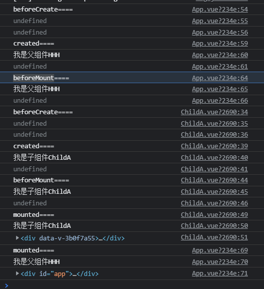

## vue 生命周期

+  Vue 实例在被创建时，经过一系列初始化的过程。
+ 创建、初始化数据、编译模板、将实例挂载到 DOM 、并在数据变化时更新 DOM、卸载 等。
+ 这个过程中也会运行一些叫做 **生命周期钩子** 的函数，这给了用户在不同阶段添加自己的代码的机会。

```html
<div id="app">{{message}}</div>
<script>
    const app=new Vue({
        el:'#app',
        data:{
            message:'哈哈哈'
        },
        methods:{},
        computed:{},
        beforeCreate(){
            console.log('beforeCreate====');
            console.log(this.message);
            console.log(this.$el);
        },
        created(){
            console.log('created====');
            console.log(this.message);
            console.log(this.$el);
        },
        beforeMount(){
            console.log('beforeMount====');
            console.log(this.message);
            console.log(this.$el);
        },
        mounted(){
            console.log('mounted====');
            console.log(this.message);
            console.log(this.$el);
        },
        beforeUpdate(){
            console.log('beforeUpdate====');
            console.log(this.message);
            console.log(this.$el);
        },
        updated(){
            console.log('updated====');
            console.log(this.message);
            console.log(this.$el);
        },
        beforeDestroy(){
            console.log('beforeDestroy====');
            console.log(this.message);
            console.log(this.$el);
        },
        destroyed(){
            console.log('destroyed====');
            console.log(this.message);
            console.log(this.$el);
        }

    })
</script>
```

### beforeCreate

+ 在new一个vue实例后，开始监控Data对象数据的变化、Vue内部初始化事件。
+ 只有一些默认的生命周期钩子和默认事件，el、data、methods、computed，watcher/事件回调都还没有初始化。
+ 不能在这个阶段使用data中的数据和methods中的方法

```js
//输出
beforeCreate================
undefined //->data
undefined //->$el
```

### created 

+ data、methods、computed，watcher/事件回调 已完成初始化，$el 还不存在。
+ 如果要调用 methods 中的方法，或者操作 data 中的数据，最早可以在这个阶段中操作。
+ 数据请求可放在这个阶段。

```js
//输出
created====
哈哈哈  //->data
undefined //->$el
```

### beforeMount

+ 完成了 el 和 data 初始化。在内存中已经编译好了模板，data里面的数据和模板生成HTML。
+ 但是还没有挂载到页面中，此时，页面还是旧的。

```js
//输出
beforeMount====
哈哈哈  //->data
<div id="app">"{{message}}"</div>  //->$el
```

### mounted

+ Vue实例已经初始化完成了。模板中的HTML渲染到HTML页面中。
+ 此时组件脱离了创建阶段，进入到了运行阶段。
+  如果我们想要通过插件操作页面上的DOM节点，最早可以在这个阶段中进行

```js
//输出
mounted====
哈哈哈  //->data
<div id="app">"哈哈哈"</div>  //->$el
```

### beforeUpdate

+ 视图层的数据改变时触发，发生在虚拟 DOM 重新渲染和打补丁之前。
+ 页面中的显示的数据还是旧的，data中的数据是更新后的， 页面还没有和最新的数据保持同步。

```js
//修改数据
app.message="呵呵呵"
//输出
beforeUpdate====
呵呵呵  //->data
<div id="app">"呵呵呵"</div>  //->$el,输出的是虚拟dom的内容

//this.$el输出的是虚拟dom的内容，打印
console.log(this.$el.innerHTML)
//输出，实际的页面内容还是旧的
<div id="app">"哈哈哈"</div>
```

### updated

+ 由于数据更改导致的虚拟 DOM 重新渲染和打补丁，在这之后会调用该钩子。
+ 页面显示的数据和data中的数据已经保持同步了，都是最新的。

```js
//输出
updated====
呵呵呵   //->data
<div id="app">"呵呵呵"</div> //->$el
```

### beforeDestroy

+ 实例从运行阶段进入到了销毁阶段，所有的 data 、 methods 、 指令、 过滤器 …都是处于可用状态。还没有真正被销毁。
+ 一般在这一步做一些重置的操作，比如清除掉组件中的定时器 和 监听的dom事件。

```js
//执行销毁
app.$destroy();
//输出
beforeDestroy====
呵呵呵   //->data
<div id="app">"呵呵呵"</div>//->$el

```

### destroyed

+ 在实例销毁之后调用，所有的 data 、 methods 、 指令、 过滤器 …都是处于不可用状态。组件已经被销毁了。

```js
//输出
destroy====
呵呵呵  //->data
<div id="app">"呵呵呵"</div>  //->$el

//执行销毁后，再修改数据
app.message="HHHHH";
//页面不会发生变化
app.$el===> <div id="app">"呵呵呵"</div> 
```


**父子组件**

+ 父beforeCreate—>父created—>父beforeMount—>子beforeCreate—>子created—>子beforeMount—>子mouted—>父mouted
+ 父组件要访问子子组件的数据，最早在mouted阶段



> 参考转自：
>
> [Vue - 生命周期详解](https://www.jianshu.com/p/672e967e201c)
>
> [Vue 正确理解mounted、beforeUpdate、updated三个钩子函数的关系](https://blog.csdn.net/wq_ocean_/article/details/108918689)
>
> [vue2 为什么beforeUpdate时的$el 和$data与updated时的一样](https://segmentfault.com/q/1010000011521681)

