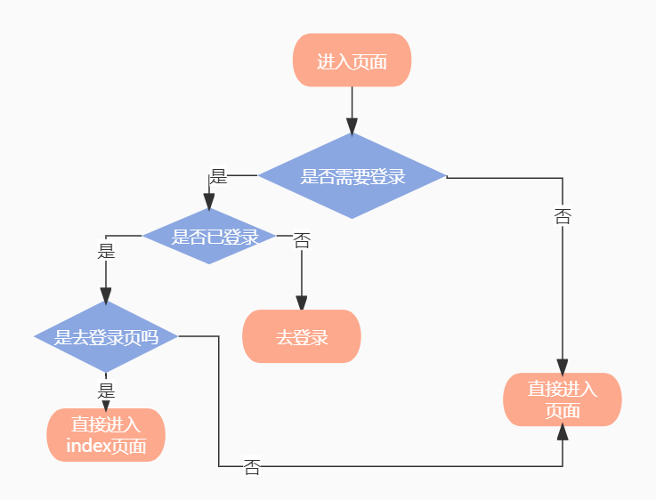
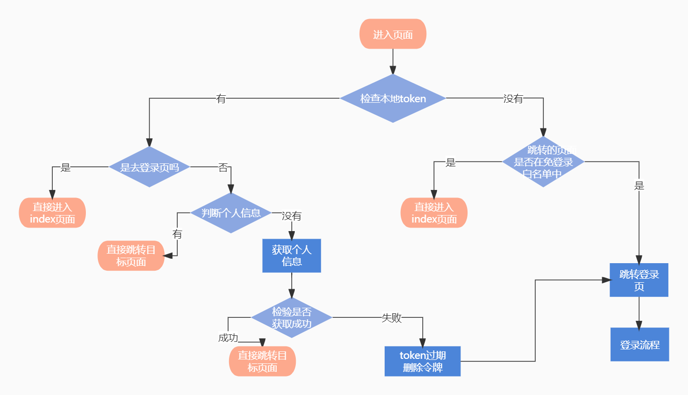

## 一、为什么做前端权限控制

从根本上讲前端没有秘密，后端才是权限的关键，那是不是只在后端做控制就可以了。

前后端权限控制他们的控制对象、控制目的和控制手段都不一样，如果仅从技术实现的角度讲，确实只在后端做控制就足够了，但在实际项目中，前端权限控制也有其不可或缺的作用，主要体现为三点：

**1、提升突破权限的门槛；**

+ 前端权限控制是系统安全的排头兵，虽然不是主力，但起码手动输 url、控制台发请求、开发者工具改数据这种级别的入侵可以防范掉

**2、过滤越权请求，减轻服务端压力；**

+ 为了省钱，不该发的请求干脆就让他发不出去，带宽都是钱买的

**3、提升用户体验。**

+ 从用户体验角度出发，一个设计优良的系统理应根据权限为每个用户展现特定的内容，避免在界面上给用户带来困扰，这是前端的本职工作，也是我个人做前端权限最大的动力之一
  

## 二、前端权限控制具体指什么

前端权限归根结底是请求的发起权，请求的发起可能由页面加载触发，也可能由页面上的按钮点击触发。

总的来说，所有的请求发起都触发自前端路由或视图，所以我们可以从这两方面入手，对触发权限的源头进行控制，最终要实现的目标是：

**1、路由方面，用户登录后只能看到自己有权访问的导航菜单，也只能访问自己有权访问的路由地址，否则将跳转 4xx 提示页；**

**2、视图方面，用户只能看到自己有权浏览的内容和有权操作的控件；**

**3、最后再加上请求控制作为最后一道防线，路由可能配置失误，按钮可能忘了加权限，这种时候请求控制可以用来兜底，越权请求将在后端被拦截。**

## 怎么做前端权限控制

控制的第一步是知道用户拥有哪些权限，所以用户登录后第一件事是获取**权限数据**。

权限数据至少应该包括**路由权限**和**资源权限**。

+ **路由权限**：用户可访问的路由集合，以此作为设置前端路由和生成导航菜单的依据；

+ **资源权限**：用户可访问的资源集合，“资源” 可以简单理解成用户能够发起的所有请求集合，以此作为**视图控制**和**请求拦截**的依据。

  

**角色概念**：可能有的系统会通过角色来做权限控制，不同的角色有不同的权限（不同的资源），如一家企业而言：BOSS、运维、运营、销售、程序员。

+ BOSS，超级管理员：是有权利操作整个项目的所有的模块

+ 运营：只能首页、商品管理者一部分菜单数据

  

引入角色这个概念的好处是，后台可以通过赋角色的方式，很方便的为某一类用户赋予特定的资源集合，而角色的作用应该仅限于此，尤其不应该将角色用做前端权限控制的依据，因为角色背后的资源权限是后端动态可配的。

我们也可以创建一个名字叫做 “总经理” 的角色，但其实一个资源都没有，所以前端应该始终关注资源权限本身，而只将角色视为用户的一个普通属性就好了。


有了权限数据下一步就是分别-实现对路由、视图、请求的控制。

### 路由控制

路由控制首先要实现动态菜单，这样就可以对常规访问方式进行限制；对于非常规访问方式比如手动修改 url，可以从前端路由处着手做控制。

路由控制的思路有两种：

+ 第一种：初始化即挂载全部路由，每次路由跳转前做校验；
+ 第二种：只挂载用户拥有的路由，相当于从源头上做了控制。

两张方式的优缺点：

+ 第一种的缺点，每次路由跳转都要做一遍校验是对计算资源的浪费，另外对于用户无权访问的路由，理论上就不应该挂载。
+ 第二种解决了上述问题，但仔细想这里存在一个悖论，要按需挂载路由就需要知道**用户的路由权限**，要知道用户的路由权限就需要**用户先登**录进来，但路由没有加载应用也没有初始化，用户从哪儿登录？

路由没有加载应用也没有初始化，用户从哪儿登录？(两种思路)

+ 第一种：单独做一个登录页，登录后带着用户凭据跳转到前端应用；
+ 第二种：先初始化一个只有登录路由的应用，用户登录后动态添加路由，当然这需要框架提供支持。


### 视图控制

+ 需要实现一个可以在视图层调用的权限验证方法，输入用户期望的权限，输出是否拥有该权限，将调用这个方法的结果，作为界面上需要验证权限的控件或元素显示与否的依据。

### 请求控制

+ 请求控制实际上就是为你使用的 HTTP 库实现一个请求拦截器，对将要发起的请求与用户资源权限进行匹配，拦截越权请求。
+ 这里值得一提的是对于携带参数的 url，需要先进行模式约定，比如/people/1这个 url 可以在权限中描述为/people/**，那么拦截器中就要先将这种 url 处理成约定后的格式，然后再进行权限验证。
  

## 基于 Vue 的实现方案

### 概述

到目前为止我们谈的都是脱离具体技术栈的实现思路，理论上可以用任何技术栈实现这个思路，但我在项目中用的是 Vue，所以下面介绍的实现细节全部基于 Vue。

先来看整个流程：


### 登录权限控制

+ 主要实现哪些页面能被游客访问，哪些页面只有登录后才能被访问。
+ 在一些没有引入角色的软件系统中,通过是否登录来评定页面能否被访问

#### 流程

简单判断：



复杂判断：



#### 代码实现

```js
router.beforeEach(async (to, from, next) => {
    // 设置页面标题
    document.title = getPageTitle(to.meta.title);
    const { needLogin = false } = to.meta;
    const { userInfo } = store.state; //从vuex中获取用户的登录信息
    //根据实际业务判断是否登录
    if (needLogin && !userInfo) {// 需要登录，但用户没有登录，跳到登录页面
        const toName=to.name;
        next({
            name: 'Login',
            params: {
                ...from.params, //如果跳转需要携带参数就把参数也传递过去
            },
            query:{
                redirect: toName,//登录成功后需要跳转的页面
                ...from.query
            }
        });
    } else if(needLogin && !userInfo&&to.name=='Login') {//需要登录，用户登录了，但是跳到登录页面，跳到/页面
        next("/");
    }else { //不需要登录直接放行
        next();
    }
});
```


是否有token？

+ 有token，判断是去登录页的吗？
  + 是去登录页，直接进入到主页面
  + 不是去登录页，判断是否有个人信息(个人信息，权限)？
    + 有个人信息，直接进入目标页面
    + 没有个人信息，去获取个人信息，需要检验获取个人信息是否成功？
      + 获取个人信息成功，直接跳转目标页面。
      + 获取个人信息失败，说明token过期，要删除令牌，并转到登录页面重新登录，并设置`redirect="目标页面"`参数，以便登录成功后跳转目标页面
+ 没有token，判断要跳转的页面是否在免登录白名单中？
  + 在免登录白名单中，直接进入目标页面。
  + 不在免登录白名单中，跳转登录页，并设置`redirect="目标页面"`参数，以便登录成功后跳转目标页面


```js
//白名单，不需要登录的页面,最好用name，用path时动态路由会出问题
const whiteList = ['Login', 'Home', '404'];
router.beforeEach(async (to, from, next) => {
    // 设置页面标题
    document.title = getPageTitle(to.meta.title);
    const hasToken = getToken();
    console.log(to)
    if (hasToken) {//有token的情况
        if (to.path === "/login") {//是去登录页的话，直接进入到主页面
            next("/");
        } else {//不是去登录页的话，先判断是否有个人信息(个人信息，权限)
            const userInfo = store.state.user.userInfo;
            if (userInfo.name) {//有个人信息，直接进入页面
                next();
            } else {//没有个人信息，获取个人信息
                try {
                    //获取个人信息成功，直接跳转目标页
                    await store.dispatch("getInfo");
                    if (to.redirectedFrom) {//解决异步路由刷新，进入404页面(或不显示)的问题。
                        next(to.redirectedFrom)
                        // router.replace(to.redirectedFrom);
                    } else {
                        next();
                    }
                } catch (error) {
                    // 获取个人信息失败，说明命令过去删除令牌并转到登录页面重新登录
                    await store.dispatch("resetToken");

                    next({
                        name: 'Login',
                        params: {
                            redirect: to.name,//登录成功后需要跳转的页面
                            ...from.params, //如果跳转需要携带参数就把参数也传递过去
                        },
                    });
                    //其他参数，传不过去
                    // next(`/login?redirect=${to.path}`);
                    next({
                        path:'/login',
                        params: {
                            ...to.params,
                        },
                        query:{
                            redirect:to.path,
                            ...to.query,
                        }
                    })
                }
            }
        }
    } else {// 没有token的情况
        if (whiteList.indexOf(to.name) !== -1) {// 在免费登录白名单中，直接进入===>或者再路由meta设置参数判断
            next();
        } else { //其他没有访问权限的页面将重定向到登录页面。
           // next(`/login?redirect=${to.path}`);
            next({
                path:'/login',
                params: {
                    ...to.params,
                },
                query:{
                    redirect:to.path,
                    ...to.query,
                }
            })
        }
    }
});
```


````js
//执行登录操作
async handleLogin() {
    const {phone,password}=this;
    await this.$store.dispatch('login',{phone,password});
     //在登录时，获取到token后，要去获取个人信息，如果不获取个人信息的话，跳转异步路由会空白，找不到这个页面，因为异步路由还没被加进路由中（不会等beforeEach中的getInfo执行完在执行跳转的内容）
    await this.$store.dispatch('getInfo');
    //接收不到其他参数
    // this.$router.push(this.$route.query.redirect|| '/');
    this.$router.push({
        path:this.$route.query.redirect,
        name:this.$route.query.name,
        param:this.$route.param,
        query:(()=>{
            let obj=this.$route.query;
            delete obj['redirect'];
            return obj||{};
        })()
    })
}
````


### 页面(路由)权限控制

+ 给不同角色赋予不同的页面访问权限


异步路由页面刷新，会重定向到404

> [一行代码解决Vue异步路由刷新后404的问题]()


paysuccess页面 必须是由 pay页面支付成功才能跳转paysuccess页面。

可以通过，路由独享守卫，进行判断是否是从pay跳转

```js
    {
        path: "/paysuccess",
        name: 'PaySuccess',
        component: () => import('@/views/PaySuccess.vue'),
        meta: {
            needLogin: true, //需要登录
            title: "PaySuccess啊",
        },
        hidden: true,
        beforeEnter(to,from,next){
            if(from.path=='/pay'){
                next();
            }else{
                //停留在当前页面
                next(false);
            }
        }
    },
```

​	

但是发现一个问题：在 pay页面下，导航输入 paysuccess，也会跳转至该页面。

​			


mode:'history',在地址栏输入会刷新页面。哈希不会

#### 切换用户

切换用户信息是非常常见的功能,但是应用在切换成不同账号后可能会引发一些问题.例如用户先使用超级管理员登录,由于超级管理员能访问所有页面,因此所有页面路由信息都会被添加到路由实例里.

此时该用户退出账号,使用一个普通会员的账号登录.在不刷新浏览器的情况下,路由实例里面仍然存放了所有页面的路由信息,即使当前账号只是一个普通会员,如果他越权访问相关页面,路由还是会跳转的,这样的结果并不是我们想要的.

解决方案

+ 第一，用户每次切换账户后刷新浏览器重新加载，刷新后的路由实例是重新配置的所以可以避免这个问题，但是刷新页面会带来不好的体验.

+ 第二，当用户选择登出后，清除掉路由实例里面处存放的路由栈信息


假设项目需求该系统存在三个角色:职员、领导和高层领导.

职员：不具备`修改`、`删除`以及`发布需求`的功能，只能查看`列表`。

领导：保留`列表`和`发布需求`按钮

高级领导：保留页面上所有内容
