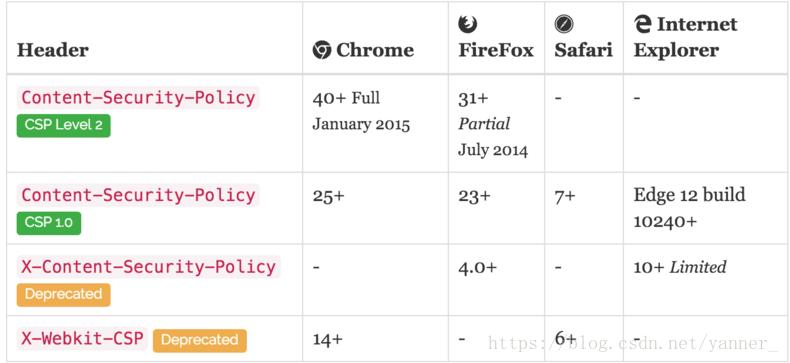

## 一、iframe
+ 嵌入第三方 iframe 会有很多不可控的问题，他们可以在iframe中运行JavaScirpt脚本、Flash插件、弹出对话框等等，这可能会破坏前端用户体验。
+ 如果iframe中的域名因为过期而被恶意攻击者抢注，或者第三方被黑客攻破，iframe中的内容被替换掉了，从而利用用户浏览器中的安全漏洞下载安装木马、恶意勒索软件等等
+ （点击劫持攻击者将目标网站通过 iframe 嵌套的方式嵌入自己的网页中，并将iframe 设置为透明，诱导用户点击。）
+ 禁止自己的 iframe 中，链接外部网站的JS

## 二、iframe基本用法
```html
<iframe src="demo_iframe_sandbox.htm"></iframe>
```

**iframe常用属性:**

```
1.frameborder:是否显示边框，1(yes),0(no)
2.height:框架作为一个普通元素的高度，建议在使用css设置。
3.width:框架作为一个普通元素的宽度，建议使用css设置。
4.name:框架的名称，window.frames[name]时专用的属性。
5.scrolling:框架的是否滚动。yes,no,auto。
6.src：内框架的地址，可以使页面地址，也可以是图片的地址。
7.srcdoc , 用来替代原来HTML body里面的内容。但是IE不支持, 不过也没什么卵用‘
8.sandbox: 对iframe进行一些列限制，IE10+支持
```

+ 我们通常使用iframe最基本的特性，就是能自由操作iframe和父框架的内容(DOM)
+ 但前提条件是同域，如果跨域顶多只能实现页面跳转`window.location.href`

## 三、防止点击劫持
+ 我们在通过iframe使用别人提供的内容时，我们自己的页面也可能正在被不法分子放到他们精心构造的iframe或者frame当中，进行点击劫持攻击。(钓鱼)
+ 这是一种欺骗性比较强，同时也需要用户高度参与才能完成的一种攻击。
+ 通常的攻击步骤是这样的：

```
+ 攻击者精心构造一个诱导用户点击的内容，比如Web页面小游戏
+ 将我们的页面放入到iframe当中
+ 利用z-index等CSS样式将这个iframe叠加到小游戏的垂直方向的正上方
+ 把iframe设置为100%透明度
+ 受害者访问到这个页面后，肉眼看到的是一个小游戏，如果受到诱导进行了点击的话，实际上点击到的却是iframe中的我们的页面
```

+ 点击劫持的危害在于，攻击利用了受害者的用户身份，在其不知情的情况下进行一些操作。
+ 如果只是迫使用户关注某个微博账号的话，看上去仿佛还可以承受，但是如果是删除某个重要文件记录，或者窃取敏感信息，那么造成的危害可就难以承受了。

##  四、防预方案

### **（1）防嵌套网页**

+ 为了防止网站被钓鱼，可以使用window.top来防止你的网页被iframe.

```js
if(window != window.top){
    window.top.location.href = correctURL;
}1234
```

+ 这段代码的主要用途是限定你的网页不能嵌套在任意网页内。
+ 如果你想引用同域的框架的话，可以判断域名。

```js
if (top.location.host != window.location.host) {
　　top.location.href = window.location.href;
}
// 检测当前网站是否被第三方iframe引用
// 若相等证明没有被第三方引用，若不等证明被第三方引用。当发现被引用时强制跳转百度。
if (top.location != window.location) {
　　top.location.href ='http://www.baidu.com';
}
```

+ 当然，如果你网页不同域名的话，上述就会报错。

```
"window.location.href"、"location.href"是本页⾯跳转
"parent.location.href"是上⼀层页⾯跳转
"top.location.href"是最外层的页⾯跳转, 因为页面之中可能嵌入了 frame 等子页面，top表示最外面一层。
```

### **（2）X-Frame-Options**

+ X-Frame-Options是一个响应头，主要是描述服务器的网页资源的iframe权限。目前的支持度是IE8+。

```
有3个选项:
+ DENY：当前页面不能被嵌套iframe里，即便是在相同域名的页面中嵌套也不允许,也不允许网页中有嵌套iframe
+ SAMEORIGIN：iframe页面的地址只能为同源域名下的页面
+ ALLOW-FROM：可以在指定的origin url的iframe中加载123
```

简单实例:

```
X-Frame-Options: DENY
拒绝任何iframe的嵌套请求

X-Frame-Options: SAMEORIGIN
只允许同源请求，例如网页为 foo.com/123.php，則 foo.com 底下的所有网页可以嵌入此网页，但是 foo.com 以外的网页不能嵌入


X-Frame-Options: ALLOW-FROM http://s3131212.com
只允许指定网页的iframe请求，不过兼容性较差Chrome不支持123456789
```

+ `X-Frame-Options`其实就是将前端js对iframe的把控交给服务器来进行处理。
+ 该属性是对页面的iframe进行一个主要限制，不过，涉及iframe的header可不止这一个，另外还有一个`Content Security Policy`, 他同样也可以对iframe进行限制，而且，他应该是以后网页安全防护的主流。

### **（3）CSP之页面防护**

+ 和`X-Frames-Options`一样，都需要在服务器端设置好相关的Header. CSP 的作用， 真的是太大了，他能够极大的防止你的页面被XSS攻击，而且可以制定js,css,img等相关资源的origin，防止被恶意注入。不过兼容性不好。
+ 而且目前市面上，流行的是3种CSP头，以及各种浏览器的兼容性：
  
+ 使用主要是在后端服务器上配置，在前端，我们可以观察Response Header 里是否有这样的一个Header:

```cms
Content-Security-Policy: default-src 'self'
```

+ 这就表明，你的网页是启用CSP的。

### **（4）限制iframe的第三方网页-sandbox属性**

+ 当`iframe`别人的页面时，我们需要对其进行安全设限，虽然，跨域时`iframe`的安全性会大很多，但是，互联网是没有安全的地方。
+ 通过h5提供的一个新属性`sandbox`可以对`iframe`的行为进行各种限制，充分实现“最小权限“原则。
+ 使用`sandbox`的最简单的方式就是只在`iframe`元素中添加上这个关键词就好：

```html
<iframe sandbox src="..."> ... </iframe>
```

+ sandbox的实现了“Secure By Default”原则，也就是说，如果你只是添加上这个属性而保持属性值为空，那么浏览器将会对iframe实施史上最严厉的调控限制，基本上来讲就是除了允许显示静态资源以外，其他什么都做不了。

+ 比如不准提交表单、不准弹窗、不准执行脚本等等，连Origin都会被强制重新分配一个唯一的值，换句话讲就是`iframe`中的页面访问它自己的服务器都会被算作跨域请求。

```
配置参数:
+ allow-forms：允许iframe中提交form表单
+ allow-popups：允许iframe中弹出新的窗口或者标签页（例如，window.open()，showModalDialog()，target=”_blank”等等）
+ allow-scripts：允许iframe中执行JavaScript
+ allow-same-origin：允许iframe中的网页开启同源策略
+ ""：设置为什么所以允许全部禁止 
```


>转自：
>
>[iframe安全问题](https://blog.csdn.net/yanner_/article/details/81428965)