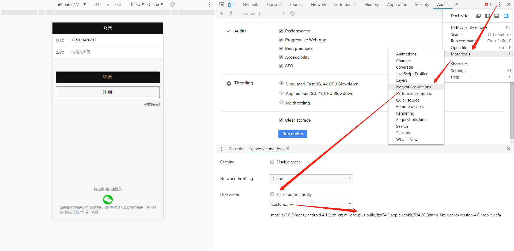

### 开发者模式（下面有配图）

开发者模式/DevTools、More tools/Network conditions/User agent/ Custom/安卓或ios代理配置配置

### 更改User agent（用户代理）

安卓微信UA： 

```
mozilla/5.0 (linux; u; android 4.1.2; zh-cn; mi-one plus build/jzo54k) applewebkit/534.30 (khtml, like gecko) version/4.0 mobile safari/534.30 micromessenger/5.0.1.352  
```

Ios微信UA：

```
mozilla/5.0 (iphone; cpu iphone os 5_1_1 like mac os x) applewebkit/534.46 (khtml, like gecko) mobile/9b206 micromessenger/5.0 
```

### 图示流程



###  

### 测试代码

```js
//判断是否微信浏览器
function isWeixinBrowser() {  
    var ua = navigator.userAgent.toLowerCase();  
    var result = (/micromessenger/.test(ua)) ? true : false;
    if (result) {
        console.log('你正在访问微信浏览器');
    }
    else {
        console.log('你访问的不是微信浏览器');
    }
    return result;
};
isWeixinBrowser();
```


> 转自：[在chrome里模拟调试微信浏览器 ](https://www.cnblogs.com/ziChin/p/10394177.html)

