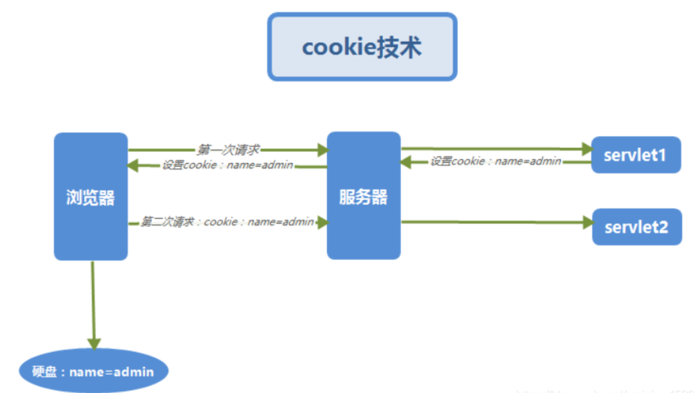

## 一、cookie

- 是一小段的**文本信息**，是某些网站为了**辨别用户身份**，进行Session跟踪而储存在用户本地终端上的数据（通常经过加密），由用户**客户端**计算机暂时或永久保存的信息。

### **1.原理**

由于HTTP是一种无状态的协议，服务器单从网络连接上无从知道客户身份。怎么办呢？就**给客户端们颁发一个通行证吧，每人一个，无论谁访问都必须携带自己通行证。这样服务器就能从通行证上确认客户身份了。这就是Cookie的工作原理**。

**如何工作：**

+ 客户端第一次请求服务器，如果服务器需要记录该用户状态，就使用response向客户端浏览器颁发一个cookie。
+ 客户端浏览器会把cookie保存起来。
+ 当浏览器再请求该网站时，浏览器**自动**添加在request header的cookie字段中一同提交给服务器。
+ 服务器检查该cookie，以此来辨认用户状态。
+ 服务器还可以根据需要修改cookie的内容。

**注：**

+ **存储在cookie中的数据，每次都会被浏览器自动放在http请求中**，如果这些数据并不是每个请求都需要发给服务端的数据，浏览器这设置自动处理无疑增加了网络开销；但如果这些数据是每个请求都需要发给服务端的数据（比如身份认证信息），浏览器这设置自动处理就大大免去了重复添加操作。
+ 所以对于那种设置“**每次请求都要携带的信息**（最典型的就是身份认证信息）”就特别适合放在cookie中，其他类型的数据就不适合了。

**Cookie有两种保存方式：**

+ 设置了过期时间，cookie就会存储在硬盘中。

+ 当会话结束时失效，即关闭浏览器窗口，cookie就会存储在内存里面。



### **2.特征**

1. cookie功能需要浏览器的支持，如果浏览器不支持cookie（如大部分手机中的浏览器）或者把cookie禁用了，cookie功能就会失效。
2. 不同的浏览器存放的cookie位置不一样，也是不能通用的。
3. 存储是以**域名形式进行区分的**，不同的域下存储的cookie是独立的。
4. 可以**设置cookie生效的域**。
5. 可以设置过期的时间，默认是会话结束的时候，当时间到期自动销毁。
6. 一个域名下存放的cookie的**个数是有限制**的，不同的浏览器存放的个数不一样,一般为20个。
7. 每个cookie存放的**内容大小也是有限制**的，不同的浏览器存放大小不一样，一般为4KB。
8. 浏览器可以禁用Cookie，禁用Cookie后，也就无法享有Cookie带来的方便。
9. 安全性无法得到保障。通常**跨站点脚本攻击**往往利用网站漏洞在网站页面中植入脚本代码或网站页面引用第三方法脚本代码，在受到跨站点脚本攻击时，脚本指令将会读取当前站点的所有Cookie 内容，然后通过某种方式将 Cookie 内容提交到指定的服务器（如：AJAX）。一旦 Cookie 落入攻击者手中，它将会重现其价值。

### 3.属性

+ **name**：cookie的名称。创建，不可更改。
+ **value**：cookie的值。
+ **maxAge**/**expires**：
  + maxAge:失效的时间，单位秒。正数，在maxAge秒之后失效；负数，关闭浏览器即失效。如果为0，表示删除该Cookie。默认：–1。
  + expires：过期日期，一个GMT格式的时间
+ **secure**：安全属性。默认：false。true，则浏览器只会在HTTPS和SSL等安全协议中传输此cookie
+ **path**：cookie的使用路径。
+ **domain**：可以访问该Cookie的域名
+ **HttpOnly：**默认：false。*true*，则服务器端不允许通过脚本document.cookie去更改这个值，同样这个值在document.cookie中也不可见，但在发送请求时依旧会携带此cookie。
+ **comment**：该Cookie的用处说明
+ **version**：该Cookie使用的版本号

### 4.**设置**

**客户端设置**

```js
document.cookie = '名字=值';
document.cookie = 'username=cfangxu;domain=baike.baidu.com'//并且设置了生效域
```

**注**：客户端可以设置cookie 的下列选项：expires、domain、path、secure，但无法设置HttpOnly选项。


**服务器端设置**

不管你是请求一个资源文件（如 html/js/css/图片），还是发送一个ajax请求，服务端都会返回response。而response header中有一项叫set-cookie，是服务端专门用来设置cookie的。

Set-Cookie 消息头是一个字符串，其格式如下（中括号中的部分是可选的）：

```js
Set-Cookie: value[; expires=date][; domain=domain][; path=path][; secure]
```

**注**：

+ 一个set-Cookie字段只能设置一个cookie，当你要想设置多个 cookie，需要添加同样多的set-Cookie字段。

+ 通过 Set-Cookie 指定的这些可选项只会在浏览器端使用，而不会被发送至服务器端。

**读取**：

+ document.cookie，得到的字符串形式的值，（获取非 HttpOnly 类型的cookie）。

**修改/删除**：

+ 不提供修改、删除操作
+ 修改：某个Cookie，只需要新建一个同名的Cookie，value值不同，添加到response中覆盖原来的Cookie。
+ 删除：某个Cookie，只需要新建一个同名的Cookie，并将maxAge设置为0，并添加到response中覆盖原来的Cookie。或expires设置为过期时间
+ 注：修改、删除时，新建的Cookie除value、maxAge之外的所有属性，例如name、path、domain等，都要与原Cookie完全一样。否则，浏览器将视为两个不同的Cookie不予覆盖，导致修改、删除失败。

### 5.cookie的应用场景

+ 对安全性要求不高
+ 不需要存储大量的数据
+ 主要应用场景，是用来做客户端与服务器之间的状态保持技术

### 案例：永久登录

需求：如果用户是在自己家的电脑上上网，登录时就可以记住他的登录信息，下次访问时不需要再次登录，直接访问即可。

思路：**把登录信息如账号、密码等保存在Cookie中，并控制Cookie的有效期，下次访问时再验证Cookie中的登录信息即可**

方案：

+ 用户名与密码都保持到Cookie中，下次访问时检查Cookie中的用户名与密码，与数据库比较。===>**比较危险的选择，一般不把密码等重要信息保存到Cookie中**
+ **把密码加密后保存到Cookie中，下次访问时解密并与数据库比较**
+ 不希望保存密码，还可以把登录的**时间戳**保存到Cookie与数据库中，到时只验证用户名与登录时间戳就可以了。
+ 只在登录时查询一次数据库，以后访问验证登录信息时不再查询数据库。实现方式是**把账号按照一定的规则加密后，连同账号一块保存到Cookie中。下次访问时只需要判断账号的加密规则是否正确即可**。

**最后方案**采用第四种：

+ 把账号保存到名为**account**的Cookie中，把**账号连同密钥**用MD1算法加密后保存到名为**ssid**的Cookie中。验证时验证Cookie中的账号与密钥加密后是否与Cookie中的ssid相等。

**服务端检验流程：**

+ 如果Cookie不为空
  +  遍历Cookie---->如果Cookie名为 account，保存account内容；如果名为ssid，保存ssid内容

+ 如果account、ssid都不为空
  + 检验，(cookie中account+服务器密钥)加密规则加密===cookie中的ssid
  + 加密规则正确, 则视为已经登录

## 二、session

> **1）web中什么是会话 ？**

+ 用户开一个浏览器，点击多个超链接，访问服务器多个web资源，然后关闭浏览器，整个过程称之为一个会话。

> **2）什么是Session ？**

+ Session:在计算机中，尤其是在网络应用中，称为“**会话控制**”。Session 对象存储特定用户会话所需的属性及配置信息。
+ Session是**服务器端**使用的一种**记录客户端状态**的机制，使用上比Cookie简单一些，相应的也**增加了服务器的存储压力**。
+ 当客户端浏览器访问服务器的时，会在服务器端的内存里开辟一块内存，把客户端信息以某种形式记录在内存上，这就是Session。客户端浏览器再次访问时只需要从该Session中查找该客户的状态就可以了。
+ 如果说**Cookie机制**是通过检查客户身上的**“通行证”**来确定客户身份的话，那**么Session机制**就是通过检查服务器上的**“客户明细表”**来确认客户身份。Session相当于程序在服务器上建立的一份客户档案，客户来访的时候只需要查询客户档案表就可以了。
+ **Cookie通过在客户端记录信息确定用户身份**，**Session通过在服务器端记录信息确定用户身份**。

### 1. 原理

+ **Session对象是在客户端第一次访问服务器的时候自动创建**。

+ Session是由应用服务器维持的一个**服务器端的存储空间**，用户在连接服务器时，会由服务器生成一个唯一的SessionID，用该SessionID 为标识符来存取服务器端的Session存储空间。

+ 客户端请求服务器的时候会发送当前会话的SessionID，服务器根据当前SessionID判断相应的用户数据标志，以确定用户是否登录，或具有某种权限。

**两种实现方式：**

+ **cookie**：把SessionID 存在Cookie中，用户提交页面时，会将这SessionID提交到服务器端，用该SessionID 为标识符来存取Session数据。

+ **URL地址重写**
  + URL地址重写是对客户端不支持Cookie的解决方案。
  + 将该用户SessionID信息重写到URL地址中。服务器能够解析重写后的URL获取SessionID。HttpServletResponse类提供了encodeURL(Stringurl)实现URL地址重写。
  + 如果客户端支持cookie，生成原URL地址，如果不支持Cookie，传回重写后的带有SessionID字符串的地址。

### 2.特征

+ 保存在服务器端，一般把Session放在内存里。
+ 内容过于复杂，当大量客户访问服务器时可能会导致内存溢出。因此，Session里的信息应该尽量精简。

**生命周期**

+ **根据需求设定**，一般来说，半小时。举个例子，你登录一个服务器，服务器返回给你一个sessionID，登录成功之后的半小时之内没有对该服务器进行任何HTTP请求，半小时后你进行一次HTTP请求，会提示你重新登录。

**有效期**

+ 为防止内存溢出，服务器会把长时间内没有活跃的Session从内存删除。这个时间就是Session的超时时间。如果超过了超时时间没访问过服务器，Session就自动失效了。

### 3.属性方法

+  **setAttribute**(String attribute, Object value)：设置Session属性
+ **getAttribute**(String attribute)：返回Session属性。
+ **getAttributeNames**()  ：返回Session中存在的属性名。
+ **removeAttribute**(String attribute)：移除Session属性。
+ **getId**()：返回Session的ID。该ID由服务器自动创建，不会重复。
+ **getCreationTime**() ： 返回Session的创建日期。
+ **getLastAccessedTime**()  ：返回Session的最后活跃时间。
+ **getMaxInactiveInterval**()  ：返回Session的超时时间。
+ **setMaxInactiveInterval**(int second) ： 设置Session的超时时间。
+ **isNew**()：  返回该Session是否是新创建的。
+ **invalidate**()：  使该Session失效。


### session和cookie的区别
+ session 保存在服务器，客户端不知道其中的信息；cookie 保存在客户端，服务器能够知道其中的信息
+ session 中保存的是对象，cookie 中保存的是字符串
+ session 不能区分路径，同一个用户在访问一个网站期间，所有的session在任何地方都可以访问到。而 cookie 中如果设置了路径参数，那么同一个网站不同路径下的 cookie 互相是不可以访问的
+ cookie 不是很安全，可以分析存放在本地的 cookie 并进行 cookie 欺骗
+ session 会在一定时间内保存在服务器上。当访问增多，会占用你服务器的性能。考虑到减轻服务器性能方面，应该使用 cookie 
+ 单个 cookie 保存的数据不能超过 4k ，很多浏览器都限制一个站点最多保存 20 个 cookie
+ session 是通过 cookie来工作的
  + session的信息是通过sessionid获取的，而sessionid是存放在会话cookie

### 4.cookie和session结合使用

+ **存储在服务端**：通过cookie存储一个sessionId，然后具体的数据则是保存在session中。如果用户已经登录，则服务器会在cookie中保存一个sessionId，下次再次请求的时候，会把该sessionId携带上来，服务器根据sessionId在Session库中获取用户的Session数据。就能知道该用户到底是谁，以及之前保存的一些状态信息。这种专业术语叫做server side session。

+ **将session数据加密，然后存储在cookie中**。这种专业术语叫做client side session。flask采用的就是这种方式，但是也可以替换成其他形式。

  

> **参考转发自：**
>
> [彻底了解Cookie和Session的区别](https://blog.csdn.net/weixin_45393094/article/details/104747360)
>
> [cookie和session的详解与区别](https://www.cnblogs.com/l199616j/p/11195667.html)
>
> [前端常见面试-存储/缓存篇](https://www.cnblogs.com/xiaonian8/p/14085588.html)


## 三、WebStorage

+ WebStorage的目的是克服由cookie所带来的一些限制，当数据需要被严格控制在客户端时，不需要持续的将数据发回服务器。
+ localstorage、sessionstorage

### 1.特征

**优点**

+ **存储空间更大：**cookie为4KB，而WebStorage是5MB。 <br
+ **节省网络流量**：不会传送到服务器，存储在本地的数据可以直接获取，也不会像cookie一样每次请求都会传送到服务器，所以减少了客户端和服务端的交互，节省了网络流量。 
+ **安全性**：不会随着HTTP header发送到服务器端，所以安全性相对于cookie来说会比较高一些，不会担心截获，但是仍然存在伪造问题。
+ **快速显示**：有的数据存储在WebStorage上再加上浏览器本身的缓存。获取数据时可以从本地获取会比从服务器端获取快得多，所以速度更快。
+ 提供了一些方法，数据操作比cookie方便
+ 对于那种只需要在用户浏览一组页面期间保存而关闭浏览器后就可以丢弃的数据，sessionStorage会非常方便。 

**缺点：**

+ 浏览器大小不一，IE8+的浏览器支持 

+ 值类型限定为string类型，JSON对象类型需要一些转换。
+ 本质上是对字符串的读取，如果存储内容多的话会消耗内存空间，会导致页面变卡
+ 不能被爬虫抓取到
+ 隐私模式下面是不可读取的
+ localStorage与sessionStorage的唯一一点区别就是localStorage属于永久性存储，而sessionStorage属于当会话结束的时候，sessionStorage中的键值对会被清空

```html
<a href="b.shtml" >跳转b</a>  <!--name=> hjj-->
<a href="b.shtml"  target="_blank">跳转b_blank</a> <!--name=> null-->
<script>
     sessionStorage.setItem('name','hjj');
</script>
```

 ### 2.属性方法

+ **length**：唯一的属性，只读，用来获取storage内的键值对数量。

- **key(index)**：获取某个索引的key
- **getItem("key")**：获取存储的信息
- **setItem("key", "value")**：创建或者修改存储的信息
- **removeItem("key")**：删除某一个存储的信息
- **clear()**：清空所有的存储信息

```js
sessionStorage.setItem('name','hjj')
sessionStorage.setItem('age','18')
console.log(sessionStorage)// Storage {age: "18", name: "hjj", length: 2}
console.log(sessionStorage.length)//2
console.log(sessionStorage.key(0))//age
console.log(sessionStorage.getItem('name'))// hjj
```


## 四、cookie、session、WebStorage区别

| 特性         | cookie                                                       | session                                                      | WebStorage<br>(localStorage/sessionStorage)                  |
| ------------ | :----------------------------------------------------------- | ------------------------------------------------------------ | ------------------------------------------------------------ |
| 由谁初始化   | 客户端或服务器，服务器可以使用`Set-Cookie`请求头。           | 服务器端                                                     | 客户端                                                       |
| 存放位置     | 客户端                                                       | 服务器端                                                     | 客户端                                                       |
| 生命周期     | 一般由服务器生成，可设置失效时间，如果在浏览器生成，默认是关闭浏览器之后失效 | 一般来说，半小时。可设置有效期时间                           | **localStorage：**永久保存，除非主动删除数据<br/>**sessionStorage：**仅在当前会话有效，在关闭了页面后就会被销毁 |
| 存放数据大小 | 4KB                                                          | 没有限制                                                     | 5MB，各家浏览器不同                                          |
| 存储内容类型 | 字符串类型                                                   | 对象（session中可含有多个对象）                              | 字符串类型                                                   |
| 与服务器通信 | 每次都会携带在HTTP头中，如果使用cookie保存过多数据会带来性能问题 | 保存在服务器                                                 | 仅在客户端保存                                               |
| 访问权限     | 任意窗口(该path、domain下的页面)                             | 任意窗口                                                     | **localStorage：**同源域名窗口<br>**sessionStorage：**当前页面窗口 |
| 安全性       | 安全性较低                                                   | session的安全性大于cookie                                    | 不会随着HTTP header发送到服务器端，所以安全性相对于cookie来说会比较高一些，不会担心截获，但是仍然存在伪造问题。 |
| 优点         | (1) 给用户更人性化的使用体验，如记住“密码功能”、老用户登录欢迎语 <br/>(2) 弥补了HTTP无连接特性  <br/>(3) 站点统计访问人数的一个依据 | (1) session 不能区分路径，同一个用户在访问一个网站期间，所有的session在任何地方都可以访问到。 <br/>(2) session 保存在服务器，客户端不知道其中的信息，相对cookie安全 | 存储空间更大**、**节省网络流量 、快速显示 <br/>安全性：不会随着HTTP header发送到服务器端 <br/>提供了一些方法，数据操作比cookie方便 |
| 缺点         | (1) 大小受限 <br>(2) 浏览器可以禁用Cookie <br/>(3) 安全性较低 <br/>(4) 每次访问都要传送cookie给服务器，浪费宽带   <br/>(6) cookie数据有路径（path）的概念，可以限制cookie只属于某个路径下 | (1) session保存的东西越多，就越占用服务器内存，对于用户在线人数较多的网站，服务器的内存压力会比较大<br/> (2) 依赖于cookie（sessionid保存在cookie），如果禁用cookie，则要使用URL重写<br/> (3) 创建session变量有很大的随意性，可随时调用，不需要开发者做精确地处理，所以过度的使用session变量将会导致代码不可读而且不好维护。 | (1) 浏览器大小不一，IE8+的浏览器支持 <br/> (2) 只支持string类型的存储，JSON对象需要转换<br/>(3)本质上是对字符串的读取，如果存储内容多的话会消耗内存空间，会导致页面变卡 <br/>(4) 隐私模式下面是不可读取的 <br/>(5) 不能被爬虫抓取到 <br/>(6) 需要手动删除，否则长期存在 |
| 用途         | 一般由服务器生成，用于标识用户身份                           | 存储用户会话所需的属性及配置信息，通常和cookie一起使用，用于标识用户身份 | 用于浏览器缓存数据                                           |
| 应用         | （1）判断用户是否登录过网站，以便下次登录时能够实现自动登录（或者记住密码）。 （2）保存上次登录的事件等信息。 （3）保存上次查看的页面 （4）浏览计数 | （1）网上商城中的购物车 （2）保存用户登录信息 （3）将某些数据放入session中，供同一用户的不同页面使用 （4）防止用户非法登录 | **localStorage：**常用于长期登录（+判断用户是否已登录），适合长期保存在本地的数据<br>**sessionStorage：**敏感账号一次性登录 |


>学习转自：
>
>[浅谈cookie，session和localStorage，sessionStorage的区别](https://segmentfault.com/a/1190000017155151)
>
>[浏览器缓存原理以及本地存储](https://segmentfault.com/a/1190000017185195)

