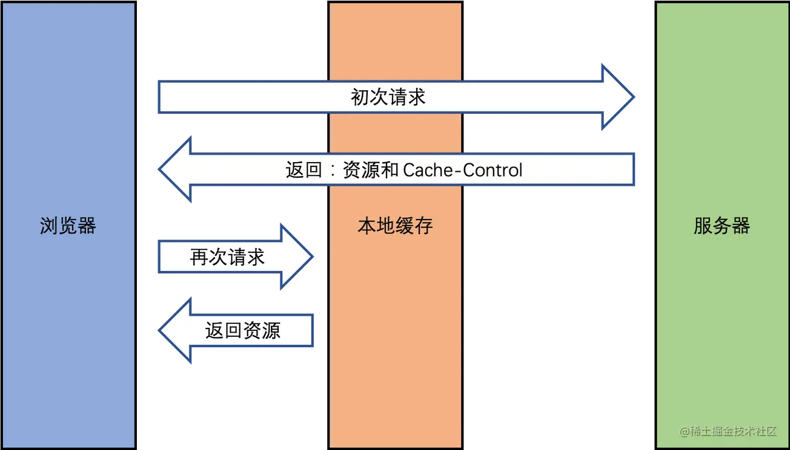
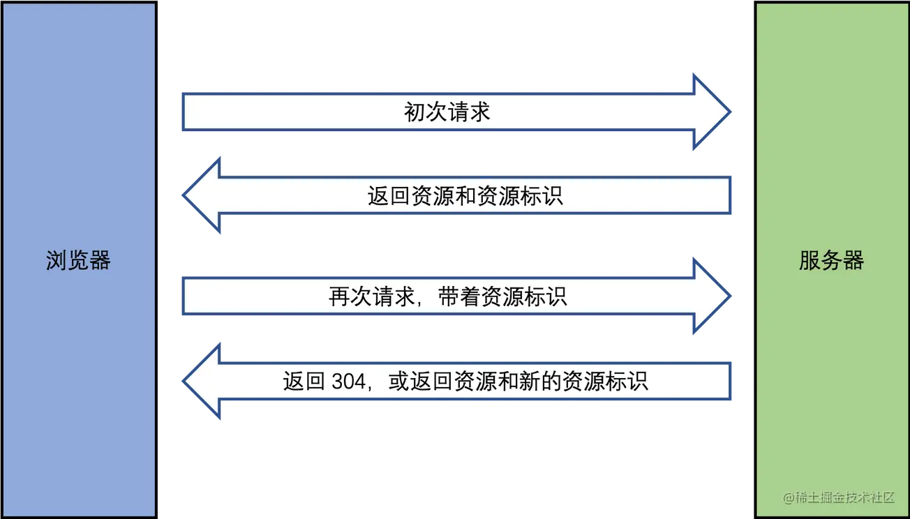
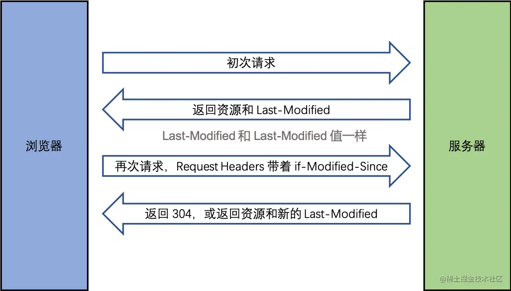
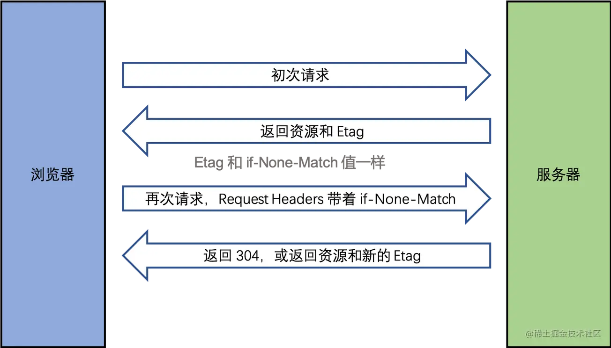

## 一、http 状态码

**状态码分类**

- 1xx - 服务器收到请求。
- 2xx - 请求成功，如 200。
- 3xx - 重定向，如 302。
- 4xx - 客户端错误，如 404。
- 5xx - 服务端错误，如 500。

**常见状态码**

- 200 - 成功。
- 301 - 永久重定向（配合 location，浏览器自动处理）。
- 302 - 临时重定向（配合 location，浏览器自动处理）。
- 304 - 资源未被修改。
- 403 - 没权限。
- 404 - 资源未找到。
- 500 - 服务器错误。
- 504 - 网关超时。

**关于协议和规范**

- 状态码都是约定出来的。
- 要求大家都跟着执行。
- 不要违反规范，例如 IE 浏览器。

## 二、http 缓存

[详情链接]

- 关于缓存的介绍。
- http 缓存策略（强制缓存 + 协商缓存）。
- 刷新操作方式，对缓存的影响。

### 1、 关于缓存

+ 什么是缓存？ 把一些不需要重新获取的内容再重新获取一次

+ 为什么需要缓存？ 网络请求相比于 CPU 的计算和页面渲染是非常非常慢的。

+ 哪些资源可以被缓存？ 静态资源，比如 js css img。

### 2 强制缓存

**三种情况：**

+ 不存在该缓存结果和缓存标识，强制缓存失效，则直接向服务器发起请求。
+ 存在该缓存结果和缓存标识，但该结果已失效，强制缓存失效，则使用协商缓存。
+ 存在该缓存结果和缓存标识，且该结果尚未失效，强制缓存生效，直接返回该结果

**Expires**：缓存的到期时间，不好因为（客户端和服务端有一方的时间不准确）会发生误差

**Cache-Control：**

- 在 Response Headers 中。
- 控制强制缓存的逻辑。
- 例如 Cache-Control: max-age=3153600（单位是秒）

**Cache-Control 有哪些值：**

- max-age：缓存最大过期时间。
- no-cache：可以在客户端存储资源，每次都必须去服务端做新鲜度校验，来决定从服务端获取新的资源（200）还是使用客户端缓存（304）。
- no-store：永远都不要在客户端存储资源，永远都去原始服务器去获取资源。

### 3、协商缓存（对比缓存）

- 服务端缓存策略。
- 服务端判断客户端资源，是否和服务端资源一样。
- 一致则返回 304，否则返回 200 和最新的资源。

 资源标识：

- 在 Response Headers 中，有两种。
- Last-Modified：资源的最后修改时间。
- Etag：资源的唯一标识（一个字符串，类似于人类的指纹）。

**Last-Modified：**  服务端拿到 if-Modified-Since 之后拿这个时间去和服务端资源最后修改时间做比较，如果一致则返回 304 ，不一致（也就是资源已经更新了）就返回 200 和新的资源及新的 Last-Modified。

**Etag：**  其实 Etag 和 Last-Modified 一样的，只不过 Etag 是服务端对资源按照一定方式（比如 contenthash）计算出来的唯一标识，就像人类指纹一样，传给客户端之后，客户端再传过来时候，服务端会将其与现在的资源计算出来的唯一标识做比较，一致则返回 304，不一致就返回 200 和新的资源及新的 Etag。

**两者比较：**

- 优先使用 Etag。
- Last-Modified 只能精确到秒级。
- 如果资源被重复生成，而内容不变，则 Etag 更精确。

### 4、 综述

+ 强制缓存优先于协商缓存进行，若强制缓存(Expires和Cache-Control)生效则直接使用缓存
+ 若不生效则进行协商缓存(Last-Modified / If-Modified-Since和Etag / If-None-Match)
+ 协商缓存由服务器决定是否使用缓存
+ 若协商缓存失效，那么代表该请求的缓存失效，重新获取请求结果，再存入浏览器缓存中；生效则返回304，继续使用缓存

+ 缓存不存在，直接发请求获取资源。
+ 缓存存在，cache-control没有过期，读取缓存
+ 缓存存在，cache-control过期，携带 If-None-Match(Etag)向服务器请求，如果资源更新，返回200，加载页面
+ 缓存存在，cache-control过期，携带 If-None-Match(Etag)向服务器请求，如果资源没有更新，返回304，使用缓存

### 5、 三种刷新操作对 http 缓存的影响

正常操作：地址栏输入 url，跳转链接，前进后退等。

手动刷新：f5，点击刷新按钮，右键菜单刷新。

强制刷新：ctrl + f5，shift+command+r。

+ 正常操作：强制缓存有效，协商缓存有效。 
+ 手动刷新：强制缓存失效，协商缓存有效。
+ 强制刷新：强制缓存失效，协商缓存失效。

## 三、 GET 和 POST 的区别。

- 从**缓存**的角度，GET 请求会被浏览器主动缓存下来，留下历史记录，而 POST 默认不会。
- 从**编码**的角度，GET 只能进行 URL 编码，只能接收 ASCII 字符，而 POST 没有限制。
- 从**参数**的角度，GET 一般放在 URL 中，因此不安全，POST 放在请求体中，更适合传输敏感信息。
- 从**幂等性**的角度，GET 是幂等的，而 POST 不是。(幂等表示执行相同的操作，结果也是相同的)
- 从 **TCP** 的角度，GET 请求会把请求报文一次性发出去，而 POST 会分为两个 TCP 数据包，首先发 header 部分，如果服务器响应 100(continue)， 然后发 body 部分。(火狐浏览器除外，它的 POST 请求只发一个 TCP 包)

## 四、HTTP/2 有哪些改进？

- 头部压缩。
- 多路复用。
- 服务器推送。

### 5、跨域问题

#### **CORS**

+ 跨来源资源共享
+ 基本思想：使用额外的HTTP头部让浏览器与服务器进行沟通，从而决定是否接受跨域请求
+ 浏览器在跨域访问时，会自动添加HTTP头信息，或者发起预检请求
+ 关键在于服务器是否做了CORS配置，允许跨域访问。
+ 

### 6、Token服务端身份验证的流行方案

### 7、前端埋点

### 8、每个页面需要计算浏览轨迹，怎么实现