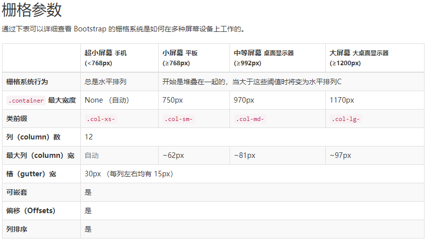
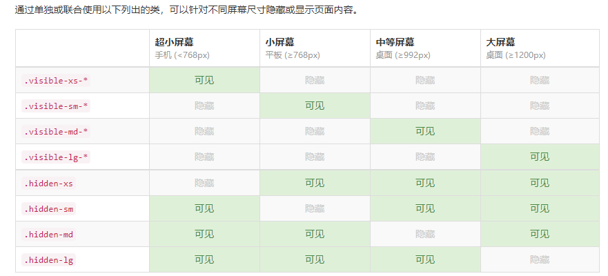

#### bootstrap--查文档

- 简介
  + ui框架，有预制界面组件。css html js。用于开发响应式布局、移动设备优先的 WEB 项目。
  + 响应式框架：amazeui
  + 可以自定义样式，修改默认样式。
  + 底层是媒体查询
- 基本模板

```html
   <!--h5文档申明-->
   <!DOCTYPE html>
   <!--文档语言申明  en英文 zh-CN中文简体 zh-tw中文繁体 -->
   <html lang="zh-CN">
   <head>
       <!--文档编码申明-->
       <meta charset="utf-8">
       <!--要求当前网页使用浏览器最高版本的内核来渲染-->
       <meta http-equiv="X-UA-Compatible" content="IE=edge">
       <!--视口的设置：视口的宽度和设备一致，默认的缩放比例和PC端一致，用户不能自行缩放-->
       <meta name="viewport" content="width=device-width, initial-scale=1, user-scalable=0">
       <!-- 上述3个meta标签*必须*放在最前面，任何其他内容都*必须*跟随其后！ -->
       <!-- 优先加载和浏览器解释 -->
   
       <title>title</title>
   
       <!-- Bootstrap 核心样式-->
       <link href="../lib/bootstrap/css/bootstrap.css" rel="stylesheet">
       <!-- html5shiv 和  respond 分别用来解决IE8版本浏览器不支持 H5标签和媒体查询的  不兼容问题-->
       <!-- HTML5 shiv and Respond.js for IE8 support of HTML5 elements and media queries -->
       <!-- 警告：不能以file形式打开，本地打开。最好http://打开 -->
       <!-- WARNING: Respond.js doesn't work if you view the page via file:// -->
       <!-- 在 IE 9 以下引入-->
       <!--[if lt IE 9]>
       <script src="../lib/html5shiv/html5shiv.min.js"></script>
       <script src="../lib/respond/respond.min.js"></script>
       <![endif]-->
   </head>
   <body>
   <!--TODO-->
    
   <!-- bootstrap依赖jquery-->
   <!-- jQuery (necessary for Bootstrap's JavaScript plugins) -->
   <script src="../lib/jquery/jquery.min.js"></script>
   <!-- bootstrap js 核心文件-->
   <!-- Include all compiled plugins (below), or include individual files as needed -->
   <script src="../lib/bootstrap/js/bootstrap.min.js"></script>
   </body>
   </html>
```

- Normalize.css和reset.css
  + Normalize.css：这是由 Nicolas Gallagher 和 Jonathan Neal 维护的一个CSS 重置样式库。
  + reset.css自己写的
  + 共同点：都是重置样式库，增强浏览器的表现一致性
  + 不同点：举个例子（ul）
    1. reset.css   list-style:none ---因为需求
    2. normalize.css 不会重置ul样式 ---本身已经在每个浏览器表现一致的元素
  + 一句话：都是增强浏览器的表现一致性，本身一致的reset.css可能会去改，但是normalize不会重置已经一致的元素
- .container-响应式布局容器；.container-fluid-流式布局容器
- 栅格系统
  + 其实就是行和列的布局，网格状布局
  + 行.row：.container容器默认有15px的左右内间距  .row 填充父容器的15px的左右内间距   margin-left,margin-right -15px拉伸 
  + 列：col-\*-*  col：列样式：*不确定（参数）
    - 第一个*：屏幕的大小
      1. 大屏设备     lg   大屏设备以上生效包含本身
      2. 中屏设备     md   中屏设备以上生效包含本身
      3. 小屏设备     sm   小屏设备以上生效包含本身
      4. 超小屏设备   xs   超小屏设备以上生效包含本身
    - 第二个*：每一行的分等份，默认分成12等份 ，数字代表的是占多少份
  +   
  + 栅格嵌套
  + 列的偏移 col-xs-offset-1
  + 列的排序 
    1. push 往后推 col-xs-push-9
    2. pull 往前拉 col-xs-pull-3
 - 响应式工具
   + 针对不同设备展示或隐藏页面内容
   +  
   + 3.2版本以后  建议使用hidden
- 常用类：
  + .container
  + .row  .col-\*-*  .col-\*-offset-*  .col-\*-pull-*  .col-\*-push-*
  + 浮动:.pull-left .pull-right 
  + 文字:.text-center .text-right .text-left  
  + 响应式工具：hidden-xs hidden-sm hidden-md hidden-lg

- 

