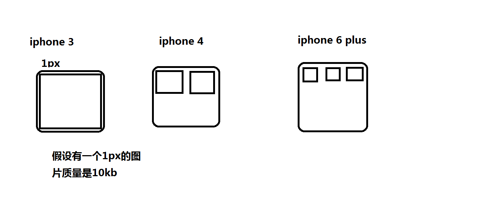
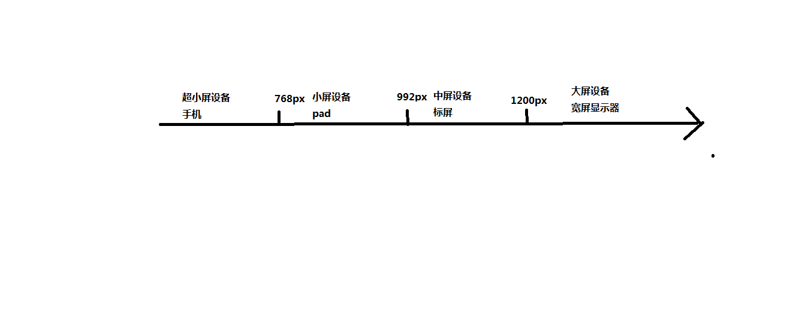

# 移动web端
### 流式布局

- 就是百分比布局，非固定像素，内容向两侧填充，理解成流动的布局，称为流式布局

### 移动端的viewport-视觉窗口

- viewport是移动端特有。这是一个虚拟的区域，承载网页的，DOM检查不到。
- 承载关系：浏览器承载viewport,viewport承载网页（浏览器---->viewport---->网页）
- pc端网页放到移动端，并正常浏览的过程叫适配
- 设备独立像素 = CSS 像素 = 逻辑像素，DIP，单位为px。
- 设备像素 = 物理像素，分辨率，单位为pt。
- DPR（ 设备像素比）= 物理像素 / 独立像素。
  
   + iphone3 一个物理像素点的大小和一个px大小正好一样，一个px大小的屏幕里只有一个物理像素点  一个物理像素点装10kb
   + iphone4 一个px大小的屏幕里有两个物理像素点  一个物理像素点装5kb 图片质量降低
   + iphone6 plus  一个px大小的屏幕里有三个物理像素点  一个物理像素点装3.33kb  物理像素显示出来
   + 为了让图片清晰 在iphone4下准备2px-20kb的图片  （2px变大，图片质量也变大）  压缩显示到1px屏幕，图片原本质量没变，只是尺寸变了，一个物理像素就是10kb

## 适配方案

### 标准适配方案

**问题：**pc端网页，放在移动端会出现缩放效果。

**适配要求：**
+ 网页宽度必须和浏览器保持一致(浏览器的宽度装载不了网页的宽度会出现滚动条，浏览器和设备一致，viewport和浏览器一致)
+ 默认显示的缩放比例和PC端保持（缩放比例1.0）
+ 不允许用户自行缩放网页
+ 满足这些要求达到了适配，国际上通用的适配方案，标准的移动端适配方案。

**适配设置：**
+ 如果任何设置都没有，默认走的就是viewport的默认设置

+ `<meta name="viewport">` :设置视口的标签,在head里面并且应该紧接着编码设置

+ viewport的功能：
    1. width    可以设置宽度   (device-width 当前设备的宽度)
    2. height   可以设置高度
    3. initial-scale  可以设置默认的缩放比例
    4. user-scalable  可以设置是否允许用户自行缩放
    5. maximum-scale  可以设置最大缩放比例
    6. minimum-scale  可以设置最小缩放比例
    
+ 在`<meta name="viewport" content="" >`content="" 使用以上参数
    1. width=device-width   宽度一致比例是1.0 视口和浏览器一样，视口和网页一致
    2. initial-scale=1.0    宽度一致比例是1.0
    3. user-scalable=no     不允许用户自行缩放  （yes，no  1,0）
    
    ``` html
    <!--标准适配方案：-->
    <meta name="viewport" content="width=device-width,initial-scale=1.0,user-scalable=0">
    ```
    
+ meta:vp + tab  快捷方式

### 非主流适配方案（淘宝）

   + 页面的真实尺寸会比在设备的上尺寸要大几倍
   + 假设设备是iphone4 -> 320px -> 网页尺寸 640px
   + 缩放操作，有2倍的  有3倍  和屏幕像素比(dpr)有关系
   + 什么是屏幕像素（dpr：物理像素/独立像素，像素点） px(页面的尺寸单位)
   + 物理像素：是设备显示屏的最小可视颗粒的大小  
   + 以前的手机（直板手机），现在有 高清显示屏  视网膜屏  retina屏（更多的像素点压缩在一块屏幕里）
   + 显示的效果就提高了更细腻，但是在显示同等质量的图片的时候（模糊效果）
     + 屏幕清晰度提高了，但是网页质量图片质量不提高，会产生模糊效果
   + 在屏幕像素比（一个px宽的屏幕能放几个物理像素）高的设备  图片（非矢量）显示会模糊
   + 提高网页的清晰度  根据屏幕的像素比 来缩放网页
   + 但是这样的适配方案成本非常高
   + 一般的企业开发当中使用的还是标准化设置，在高清显示屏当中：图片可能会失真（模糊）

### 版心

- 最大宽度设置成了640px  max-width: 640px;
- 路径的绘制
- 设计稿psd的尺寸就是640px
  + 目的：当设备的尺寸比设计稿不至于失真
- 640px的尺寸设计稿的原因：根据当前主要流行的设备尺寸有关系iphone4,4s 尺寸320px
- 750px的设计稿：参考原型iphone6 尺寸375px
- 最小宽度320px  保证最小的宽度320px不让页面错乱   min-width: 320px;

## 常见问题

### 不建议在移动端使用jquery  

   + 可以使用jquery,但是不建议
   + jquery  做了很多桌面浏览器（pc端浏览器)的兼容问题 特别是IE，但是移动端没有IE浏览器）
   + 移动端主流的浏览器：谷歌、火狐（2016年停止了维护和更新） 、safari浏览器 、 百度 、 360 、qq ...
   + 特点：内核基本上都是  webkit  或者 blink， 兼容  `-webkit-`
   + 使用H5的api 或者使用一个 叫做： zepto.js 的库（基于高版本浏览器开发）  

### box-sizing

   + 移动端以流式布局为主,百分比布局,非固定像素布局
   + 无法准确计算容器的尺寸 
   + `box-sizing: border-box; `防止内容溢出  不出现滚动条  提供用户体验

### 点击高亮

   + 轻击 轻触 高亮效果

```css
-webkit-tap-highlight-color: red;
```

   + 轻击 轻触 不高亮效果

```css
-webkit-tap-highlight-color: transparent;
```

### 二倍图解决失真问题 

   + 精灵图压缩后才可以提高图片的质量，定位也要缩小一倍

### 图片的下间隙

```css
body{
    /*font-size: 0px;*/
}
img{
    display: block;
}
img{
    vertical-align: middle;
}
```
   + transform层级会提高 

## 移动端touch事件

### touch事件

**解释touch:**

+ touch是移动端的触摸事件 而且是一组事件
+ 利用touch相关事件实现移动端常见**滑动效果**和移动端常见的**手势事件**

**事件：**

+ `touchstart` 当手指触摸屏幕的时候触发
+ `touchmove` 当手指在屏幕来回的滑动时候触发
+ `touchend` 当手指离开屏幕的时候触发
+ `touchcancel` 当被迫终止滑动的时候触发（来电，弹消息）

**绑定事件 :**

```js
$box.addEventListener('touchstart',function () { });
```

**事件对象：**

+ **`touchList`**：触摸点的集合（一个手指触摸就是一个触摸点，和屏幕的接触点的个数）。

+ **`changedTouches`** ：改变后的触摸点集合
+ **`targetTouches`** ：当前元素的触发点集合
+ **`touches`**：页面上所有触发点集合


**触摸点集合在每个事件触发的时候会不会去记录触摸？**

+ changedTouches 每个事件都会记录
+ targetTouches、touches 在离开屏幕的时候无法记录触摸点

**分析滑动实现的原理：**

1. 就是让触摸的元素随着手指的滑动做位置的改变
2. 位置的改变：需要当前手指的坐标
3. 在每一个触摸点中会记录当前触摸点的坐标 e.touches[0] 第一个触摸点
4. clientX clientY      基于浏览器窗口（视口）
5. pageX   pageY        基于页面（视口）
6. screenX screenY      基于屏幕

### 移动端的手势事件

- swipe swipeLeft swipeRight swipeUp swipeDown
- 左滑和右滑手势怎么实现
```js
const bindSwipeEvent = function (dom,leftCallback,rightCallback) {
    /*手势的条件*/
    /*1.必须滑动过*/
    /*2.滑动的距离50px*/
    var isMove = false;
    var startX = 0;
    var distanceX = 0;
    dom.addEventListener('touchstart',function (e) {
        startX = e.touches[0].clientX;
    });
    dom.addEventListener('touchmove',function (e) {
        isMove = true;
        var moveX = e.touches[0].clientX;
        distanceX = moveX - startX;
    });
    dom.addEventListener('touchend',function (e) {
        /*滑动结束*/
        if(isMove && Math.abs(distanceX) > 50){
            if(distanceX > 0){
                rightCallback && rightCallback.call(this,e);//this是当前的dom对象
            }else{
                leftCallback && leftCallback.call(this,e);
            }
        }
        /*重置参数*/
        isMove = false;
        startX = 0;
        distanceX = 0;
    });
};
bindSwipeEvent(document.querySelector('.box'),function (e) {//function是windown对象
    console.log(this);
    console.log(e);
    console.log('左滑手势');
},function (e) {
    console.log(this);
    console.log(e);
    console.log('右滑手势');
});
```
## tap事件

- tap事件 ，轻击轻触，响应速度快，提高移动端点击响应，提高用户体验。

**问题：**

+ 移动端也有click事件 （在移动为了区分是滑动还是点击，click点击延时300ms）
+ 影响用户体验响应太慢了。

**解决方案：**使用tap事件、fastclick.js

### tap事件原理

**方案一：使用tap事件**

+ 不是移动端原生事件，通过touch相关事件衍生过来
+ zepto.js tap事件，了解其原理

```js
window.onload = function () {
    /*使用tap事件*/
    /*1. 响应的速度比click要快150ms */
    /*2. 不能滑动*/
    var bindTapEvent = function (dom, callback) {
        /*事件的执行顺序*/
        /*在谷歌浏览器模拟看不到300ms的效果*/
        /*在真机上面才能看看到延时效果*/
        var startTime = 0;
        var isMove = false;
        dom.addEventListener('touchstart', function () {
            startTime = Date.now();
        });
        dom.addEventListener('touchmove', function () {
            isMove = true;
        });
        dom.addEventListener('touchend', function (e) {
            if ((Date.now() - startTime) < 150 && !isMove) {
                callback && callback.call(this, e);
            }
            startTime = 0;
            isMove = false;
        });
    }

    bindTapEvent(document.querySelector('.box'), function (e) {
        console.log(this);
        console.log(e);
        console.log('tap事件')
    });
};
```
### fastclick.js

**方案2：使用一个叫：[fastclick.js]( https://www.bootcdn.cn/fastclick/) 提供移动端click响应速度的**

+ 下载：https://cdn.bootcss.com/fastclick/1.0.6/fastclick.min.js
+ 使用：

```html
   <script src="../js/fastclick.min.js"></script>
   <script>
       /*当页面的dom元素加载完成*/
       document.addEventListener('DOMContentLoaded', function() {
           /*初始化方法*/
           FastClick.attach(document.body);
       }, false);
       /*正常使用click事件就可以了*/
   </script>
```

#### 两栏自适应-小技巧
```        
            一个元素设浮动
            另外一个设overflow: hidden;
            /*让这个元素绝对绝缘  bfc*/
            /*不让其他浮动元素影响自己*/
            /*不让自己的浮动去影响别的元素*/
           
```
#### 区域滚动效果-iScroll
- 条件：一个容器装着一个容器html结构
  + 找到大容器
  + 子容器大于父容器
  ```
  //移动端使用e.preventDefault()禁止滚动及取消
  window.onload = function () {
  	document.querySelector('.jd_cateLeft').addEventListener('touchmove',function(e){
  
  	e.preventDefault();
  
  });
  document.querySelector('.jd_cateRight').addEventListener('touchmove',function(e){
  
  	e.preventDefault();
  
  });
      /*区域滚动效果*/
      /*条件：一个容器装着一个容器html结构*/
      /*找到大容器*/
      /*子容器大于父容器*/
      new IScroll(document.querySelector('.jd_cateLeft'),{
          scrollX:false,
          scrollY:true
      });
      new IScroll(document.querySelector('.jd_cateRight'),{
          scrollX:true,
          scrollY:false
      });
  }
  ```
## 响应式布局
#### 设备划分
  
#### 媒体查询
- 使用媒体查询能针对不同屏幕区间设置不同的布局和样式
- 怎么使用媒体查询：关于媒体查询 @media
- 语法：

```css
 @media screen and (max-width: 768px) and (min-width: 320px){/*大于320，小于768*/
     /*属性样式*/
}
```

- 前端开发资源库：https://www.awesomes.cn/
#### bootstrap

查文档


#### 移动端布局的适配
- 伸缩布局 flex
- 流式布局 百分比
- 响应式 媒体查询（超小屏的时候：流式布局）
- 以上三种共同点：元素只能做宽度的适配（排除图片）
- rem布局
#### zepto.js
- 轻量、高级浏览器的JavaScript库（移动端）
#### swiper.js
- 应用较广泛的移动端网页触摸内容滑动js插件
#### cors、jsonp
#### 瀑布流
#### 适配移动端
- 库-电脑/很多功能/js功能/集合工具函数的方法 插件-内存条/功能单一  
- 框架：
  + ui框架（bootstrap包含了若干个插件--完整的功能） (妹子ui,jqueryUI,easyUI,jqueryMobile,mui,framework7)
    1. 关于移动端的UI框架：bootstrap,jqueryMobile,mui,framework7
    2. 模板引擎：artTemplate,handlebars,mustache,baiduTemplate,velocity,underscore
  + js框架（带有一定的开发思想，不涉及样式）-vue 
     mvc:模型、视图、控制器，把系统分成若干份模块
  3. app


